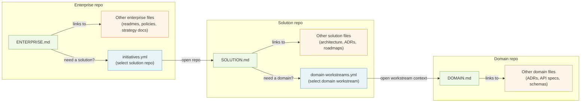

# Proposal: Multi-Level Repository Navigation and Routing Convention

Status: Draft
Audience: standards/community contributors, platform/tool builders, enterprise architecture teams
Scope: Multi-repository human and agent collaboration across enterprise, solution, and domain levels

## 1. Problem

`AGENTS.md` is strong for repo-local behavior, but enterprise delivery spans multiple repositories and architecture levels.
At scale, teams need:

1. Level-aware entrypoints.
2. Deterministic cross-repository routing.
3. Explicit ownership, governance, and failure behavior.

This proposal addresses these needs with level entrypoints (Layer A) and optional routing catalogs for automation (Layer B).

## 2. Proposed Solution

This proposal is the solution to the problem in Section 1: it keeps repo-local guidance lightweight and human-friendly, while still enabling deterministic cross-repository routing for automation when needed.

### Guiding Principle: Progressive Disclosure Across Repositories

This proposal applies progressive disclosure at every scale instead of piling everything into one repository and one file:

1. **Repository level** (Layer B, when present): routing catalogs (`initiatives.yml`, `domain-workstreams.yml`, `implementation-catalog.yml`) disclose the next stable target and, when needed, the exact workstream context to open. Resolution is deterministic -- you either resolve the selector or fail closed (see Section 5.5).
2. **File level** (Layer A): entrypoints disclose *what matters* in that repo. They are maps, not encyclopedias.
3. **Artifact level**: linked catalogs and design files disclose *the detail* -- only when you follow the link.

Each layer reveals only what is relevant at that layer. Where routing catalogs exist, they are simply the coarsest grain of disclosure.

To implement this principle, the proposal defines two independent layers (adoptable separately):

1. **Layer A: Entrypoint Convention**
   1. Purpose: human/agent navigation and context discovery.
   2. Tooling dependency: none.
2. **Layer B: Routing Catalog Specification (optional)**
   1. Purpose: deterministic machine routing between levels (for example Enterprise repo to Solution repo to Domain repo).
   2. Tooling dependency: orchestration/runtime only.

An organization can adopt Layer A without Layer B, but conformance profiles start at routed adoption.



## 3. Layer A: Entrypoint Convention

### 3.1 Entrypoint Files

1. `AGENTS.md` (existing agents.md standard; unchanged).
2. `ENTERPRISE.md` (enterprise-level entrypoint).
3. `SOLUTION.md` (solution-level entrypoint).
4. `DOMAIN.md` (domain-level entrypoint).

### 3.2 Entrypoint Rules

1. `AGENTS.md` remains the repo-local behavior contract.
2. The level entrypoint for a repository SHOULD exist when that level is present.
3. Entrypoints SHOULD stay concise and link to canonical machine artifacts instead of duplicating mutable data. This is especially important when catalogs are generated -- the entrypoint links to the artifact; it does not replicate it.
4. Upstream entrypoint links MUST be deterministic and level-explicit: `SOLUTION.md` MUST include an `ENTERPRISE.md` link when the enterprise level exists; `DOMAIN.md` MUST include an `ENTERPRISE.md` link when the enterprise level exists. `DOMAIN.md` MUST NOT require `SOLUTION.md` links for upstream navigation because solution-to-domain associations are many-to-many and can change over time; those associations belong in routing catalogs and handoff artifacts, not in Markdown ancestry.
5. When routing catalogs exist, downstream target information MUST be maintained in the canonical YAML catalogs (`initiatives.yml`, `domain-workstreams.yml`, `implementation-catalog.yml`). Entrypoints MAY include lightweight navigation links, but SHOULD avoid duplicating exhaustive downstream mappings to prevent drift.
6. If no upstream level exists, the Parent section MUST state `Not applicable`.
7. Agents MUST start with `AGENTS.md`. `AGENTS.md` MUST instruct agents to always read the repository's level entrypoint (`ENTERPRISE.md`, `SOLUTION.md`, or `DOMAIN.md`) for architectural context and navigation. The canonical instruction form is: `Always read <LEVEL>.md`.

Implementation references:

1. AGENTS handoff templates: `templates/AGENTS.ea.md.template`, `templates/AGENTS.sa.md.template`, `templates/AGENTS.da.md.template`.
2. Level entrypoint templates: `templates/ENTERPRISE.md.template`, `templates/SOLUTION.md.template`, `templates/DOMAIN.md.template`.
3. End-to-end examples: `examples/core/`, `examples/governed/`.

### 3.3 Parent Link Format

Accepted parent link forms:

1. Absolute HTTPS URL to parent entrypoint file.
2. Repository-relative path when parent is in the same repository.
3. Stable repository identifier plus path (when URL is resolved at runtime).
4. The Parent section SHOULD label upstream links by level (for example `ENTERPRISE`).

Identifier note:

1. A stable repository identifier SHOULD be provider-qualified and durable (for example `github:example-org/ea-repo`).
2. Example parent reference: `github:example-org/ea-repo#/ENTERPRISE.md`.

### 3.4 Minimal Entrypoint Examples

#### ENTERPRISE.md (minimal)

```markdown
# ENTERPRISE

Purpose: Enterprise portfolio entrypoint.

## Read First
1. This file — enterprise context and navigation

## Parent
Not applicable

## Canonical Artifacts
- initiatives.yml
- domain-registry.yml
```

#### SOLUTION.md (minimal)

```markdown
# SOLUTION

Purpose: Solution architecture entrypoint.

## Read First
1. This file — solution context and navigation

## Parent
- [ENTERPRISE](https://github.com/example/ea-repo/blob/main/ENTERPRISE.md)

## Canonical Artifacts
- domain-workstreams.yml
- solution-index.yml
```

#### DOMAIN.md (minimal)

```markdown
# DOMAIN

Purpose: Domain architecture entrypoint.

## Read First
1. This file — domain context and navigation

## Parent
- [ENTERPRISE](https://github.com/example/ea-repo/blob/main/ENTERPRISE.md)

## Canonical Artifacts
- implementation-catalog.yml
```

## 4. Bootstrap Discovery (Core for Routed Profiles)

For routed profiles (Core/Governed), implementations MUST provide at least one deterministic bootstrap mechanism that resolves the topmost level present in the organization:

1. Explicit startup parameter.
2. Environment variable.
3. Well-known discovery endpoint.

The bootstrap target is the highest-level repository in the routing chain (enterprise repo for three-level organizations, solution repo for two-level organizations). Implementations MUST document which mechanism is authoritative.

## 5. Layer B: Routing Catalog Specification

Path placement is intentionally implementation-defined.
This standard defines file names and semantics, not fixed directories.

### 5.1 Canonical Catalog Set

| Catalog | Level | Selector | Resolves |
|---|---|---|---|
| `initiatives.yml` | Enterprise | `initiative_id` | `solution_repo_url` + `solution_entrypoint` |
| `domain-workstreams.yml` | Solution | `workstream_id` | workstream context (see Section 5.3) |
| `implementation-catalog.yml` | Domain | `work_item_id` or `api_id` | implementation target/path |

Catalog resolution is defined per boundary. This specification does not guarantee automatic selector propagation across boundaries; the caller must possess or obtain the selector for the next boundary independently. Implementations MAY define handoff mechanisms that carry selectors across boundaries, but such mechanisms are implementation-specific.

Format rules:

1. YAML is the canonical format for all catalogs in this proposal.
2. JSON is allowed only as a schema-equivalent compatibility projection (same fields, same semantics).
3. When both YAML and JSON forms of a catalog exist, YAML is authoritative.
4. Consumers that support JSON MUST fail closed if YAML and JSON content disagrees.

Authorship note: Routing catalogs are typically generated artifacts -- produced by an intake pipeline that filters a richer source (for example `initiative-pipeline.yml`) and writes the selector manifest. Because they are generated, they must remain separate from the human-authored entrypoint (`ENTERPRISE.md`). Inlining them into the entrypoint would either make the entrypoint a generated file (conflicting with its role as a stable navigation guide) or introduce a hand-maintained duplicate that drifts from the pipeline source.

### 5.2 Versioning Contract

Catalog headers MUST follow the canonical schema for that catalog type:

1. `initiatives.yml` MUST include `version`.
2. `domain-workstreams.yml` MUST include `version`.
3. `implementation-catalog.yml` MUST include `spec_name` and `spec_version`.

Version rules:

1. `MAJOR`: breaking change.
2. `MINOR`: backward-compatible additive change.
3. `PATCH`: backward-compatible clarification/fix.

Runtime behavior:

1. Consumers MUST fail closed on unknown `MAJOR` versions.
2. Producers MUST provide migration notes when incrementing `MAJOR`.

### 5.3 Minimum Fields

Cross-repo target fields:

1. `initiatives.yml` entries MUST include `solution_entrypoint` (for example `SOLUTION.md`) alongside `solution_repo_url`.
2. When `domain-registry.yml` entries include `domain_repo_url`, they MUST include `domain_entrypoint` (for example `DOMAIN.md`).
3. `domain-workstreams.yml` entries MUST include `domain_id`, `workstream_entrypoint`, and `workstream_git_ref`.
   When the enterprise level exists (i.e., `initiatives.yml` is present), entries MUST also include `initiative_id` to link the workstream to its originating initiative. When no enterprise level exists (two-level topology per Section 12.2), `initiative_id` MAY be omitted.
   `initiative_id`, when present, enables correlation between workstreams and initiatives but does not create a normative routing step; the canonical selector for `domain-workstreams.yml` remains `workstream_id`.
   `domain_id` is the stable target identity and remains required even when `workstream_repo_url` is sufficient for direct runtime resolution.
4. `domain-workstreams.yml` entries MUST include `workstream_repo_url` unless the runtime has access to an authoritative `domain-registry.yml` that can resolve `domain_id` to the stable domain repository.
5. `workstream_entrypoint` MAY be `null` while the workstream context has not yet been materialized. For any routable workstream status, `workstream_entrypoint` MUST be non-null.
6. `domain-workstreams.yml` entries MAY include `workstream_path` to identify the repo-relative folder that contains the workstream artifacts.
7. `implementation-catalog.yml` entries MAY include `workstream_id` and `initiative_id` to enable bottom-up lineage from implementation artifacts to upstream workstreams and initiatives. These fields are standardized but not required; implementations that include them MUST use values consistent with the corresponding `domain-workstreams.yml` and `initiatives.yml` entries.

#### initiatives.yml

```yaml
version: "1.0"
initiatives:
  - initiative_id: init-example
    solution_repo_url: https://github.com/example/solution-repo
    solution_entrypoint: SOLUTION.md
    status: active
```

#### domain-workstreams.yml

```yaml
version: "1.0"
workstreams:
  - workstream_id: ws-init-example-order
    initiative_id: init-example
    domain_id: order
    workstream_entrypoint: inputs/workstreams/ws-init-example-order/WORKSTREAM.md
    workstream_git_ref: feature/ws-init-example-order
    workstream_repo_url: https://github.com/example/order-domain-repo
    workstream_path: inputs/workstreams/ws-init-example-order/
    status: active
```

#### implementation-catalog.yml

```yaml
spec_name: multi-scale-routing
spec_version: "1.0.0"
work_items:
  - work_item_id: job-order-api-001
    api_id: ORDER_API
    repo_path: src/order
    status: active
    # Optional upstream lineage fields (see Section 5.3 rule 7):
    # workstream_id: ws-init-example-order
    # initiative_id: init-example
```

### 5.4 Status Vocabulary (Normative)

Allowed values:

1. `active`
2. `approved`
3. `ready`
4. `in_progress`
5. `paused`
6. `completed`
7. `archived`
8. `deprecated`

Semantics:

1. `active`: routable.
2. `approved`: not routable by default; work has been authorized but not yet started.
3. `ready`: not routable by default; work is staged and ready to begin.
4. `in_progress`: routable; work is actively underway.
5. `paused`: non-routable by default; resumable by policy.
6. `completed`: read-only historical.
7. `archived`: historical, usually not in active selector views.
8. `deprecated`: read-only tombstone; never routable for write operations.

Routable by default: `active`, `in_progress`.

Implementations MAY extend the routable set to include `approved` and/or `ready` by explicit configuration. Implementations that extend the routable set MUST declare the effective routable statuses in configuration or runtime metadata so that consumers can determine the active routing mask without implementation-specific knowledge.

### 5.5 Routing Policy

1. Fail closed on missing selector ID (`ERR_SELECTOR_MISSING`).
2. Fail closed on ambiguous selector ID (`ERR_SELECTOR_AMBIGUOUS`).
3. Fail closed on non-routable status by default (`ERR_SELECTOR_NOT_ROUTABLE`).
4. Implementations MUST NOT fall back to repo-name heuristics, keyword search, or other inferred context.

These error semantics are normative for all routing behavior, regardless of whether the optional machine access contract (Section 5.7) is implemented. How implementations surface these errors (structured error objects, exceptions, log entries) is implementation-defined; the behavioral requirement to fail closed is not.

### 5.6 Selector Uniqueness

1. Each selector field MUST be independently unique within a catalog.
2. When a catalog supports multiple selector fields (for example `work_item_id` and `api_id` in `implementation-catalog.yml`), a value in one selector namespace MUST NOT collide with values in another.
3. Implementations MUST fail closed on duplicate selector values.

### 5.7 Optional Machine Access Contract

Implementations MAY expose machine access surfaces over canonical routing catalogs.

This section defines query semantics only. Transport, invocation syntax, authentication, programming language, and deployment model are implementation-defined.

Contract rules:

1. Required operations:
   1. `resolve`: return a single entry by canonical selector type and selector value.
   2. `list`: return entries for a catalog, optionally filtered by exact-match status.
   3. `validate`: report catalog integrity against the minimum checks in Section 7.
2. Input contract:
   1. `resolve` inputs MUST include a canonical selector type and selector value.
   2. `list` inputs MAY include a catalog identifier and exact-match status filter.
   3. Implementations MUST NOT require fuzzy search, keyword search, or inferred selector aliases for core resolution behavior.
3. Output contract:
   1. `resolve` responses MUST include the canonical fields required for that catalog type under Section 5.3.
   2. `list` responses MUST preserve canonical entry semantics for every returned entry.
   3. Implementations MAY add metadata or extension fields if canonical fields remain present and unmodified.
4. Error contract:
   1. Structured errors MUST include an `error_code`.
   2. Implementations MUST support at least `ERR_SELECTOR_MISSING`, `ERR_SELECTOR_AMBIGUOUS`, and `ERR_SELECTOR_NOT_ROUTABLE`.
   3. Implementations MAY also emit other error codes from Section 11 when applicable.
5. Conflict rule:
   1. Canonical YAML remains authoritative.
   2. Implementations MUST NOT return results whose canonical semantics contradict the authoritative YAML content.
6. Freshness rule:
   1. Implementations MUST either return results consistent with the current authoritative YAML revision or explicitly declare the revision or staleness boundary represented by the response.

Companion guidance and example realization patterns belong in `reference/machine-access-contract.md`.

## 6. Compatibility and Alias Policy

Canonical keys:

1. `workstreams[]` + `workstream_id`
2. `work_items[]` + `work_item_id`

Migration policy:

1. Writers MUST emit canonical keys.
2. Readers SHOULD enforce canonical keys for deterministic behavior.
3. Legacy aliases are out of scope for this draft baseline.

## 7. Catalog Health Validation (Recommended CI)

Recommended CI checks:

1. Validate schema and required fields.
2. Verify selector uniqueness (see Section 5.6).
3. Verify status-policy compliance.
4. Verify catalog version compatibility against Section 5.2.
5. Verify referenced repository URLs are reachable with CI identity (or provider API equivalent).
6. Flag stale or inaccessible routing targets before runtime.

## 8. Ownership Model

| Artifact | Recommended owner | Primary purpose |
|---|---|---|
| `AGENTS.md` | repository owners | repo-local agent behavior contract |
| `ENTERPRISE.md` | EA | enterprise context entrypoint |
| `SOLUTION.md` | SA | solution context entrypoint |
| `DOMAIN.md` | DA | domain context entrypoint |
| `initiatives.yml` | EA/PMO | enterprise->solution routing |
| `domain-workstreams.yml` | SA | solution->domain routing |
| `implementation-catalog.yml` | DA | domain->implementation routing |
| governance state artifact | governance + level owners | stage gates and progress |

Override rule:

1. If roles are collapsed in one team/repository, ownership MUST be explicitly declared in the relevant entrypoint.

## 9. Conformance Profiles

### Core Profile

Required:

1. Layer A (`AGENTS.md` plus the applicable level entrypoints)
2. deterministic bootstrap discovery mechanism for the topmost level present in the organization
3. routing catalogs for each level boundary that exists in the organization:
   1. enterprise->solution (when both enterprise and solution levels exist): `initiatives.yml`
   2. solution->domain (when both solution and domain levels exist): `domain-workstreams.yml`
   3. domain->implementation (when selector-driven domain->implementation routing boundary exists): `implementation-catalog.yml`

A two-level organization (for example Solution + Domain only) satisfies the Core profile with `domain-workstreams.yml` for solution->domain workstream routing. It requires `implementation-catalog.yml` only when selector-driven domain->implementation routing is in scope. Catalogs for absent boundaries are not required.

Core profile resolution rule:

1. `domain-workstreams.yml` MUST be self-sufficient for runtime resolution when no authoritative `domain-registry.yml` is available.
2. In that case, each workstream entry MUST include `workstream_repo_url`.
3. When an authoritative `domain-registry.yml` is available at runtime, `workstream_repo_url` MAY be omitted and `domain_id` is resolved through the registry.

### Governed Profile

Required:

1. Core profile
2. domain governance registry (for example `domain-registry.yml`)
   1. when a domain entry includes `domain_repo_url`, it MUST include `domain_entrypoint`
3. solution scope/index manifest (for example `solution-index.yml`)
4. governance state artifact with minimum fields:
   1. `spec_name`
   2. `spec_version`
   3. `layers` (dict keyed by cascade layer name, each with `status`)

Governance layer status values are separate from the routing status vocabulary in Section 5.4. Allowed governance layer statuses: `not_started`, `in_progress`, `proposed`, `approved`, `blocked`, `rejected`.

Minimal example:

```yaml
spec_name: governance-state
spec_version: "1.0.0"
layers:
  requirements:
    status: approved
    approved_by: product-owner
    approved_at: "2026-02-28T10:00:00Z"
  solution_architecture:
    status: in_progress
  domain_architecture:
    status: not_started
```

## 10. Conflict Resolution and Precedence

Precedence by concern:

1. Agent behavior/security constraints: `AGENTS.md` wins.
2. Routing and target resolution: routing catalogs win.
3. Narrative/context descriptions: level entrypoint (`ENTERPRISE.md`/`SOLUTION.md`/`DOMAIN.md`) wins.

If two artifacts conflict within the same concern domain:

1. Runtime MUST fail closed.
2. Runtime MUST emit a structured conflict error event.

## 11. Observability and Error Model (Companion Guidance, Non-Normative)

Minimum structured failure record SHOULD include:

1. `timestamp`
2. `level` (enterprise/solution/domain)
3. `selector_type`
4. `selector_id`
5. `artifact_path`
6. `error_code`
7. `message`

Recommended error codes:

1. `ERR_SELECTOR_MISSING`
2. `ERR_SELECTOR_AMBIGUOUS`
3. `ERR_SELECTOR_NOT_ROUTABLE`
4. `ERR_TARGET_UNREACHABLE`
5. `ERR_ACCESS_DENIED`
6. `ERR_PARENT_LINK_MISSING`
7. `ERR_CONFLICT`

## 12. Partial Adoption Patterns

### 12.1 Single-Level Repository

1. Use `AGENTS.md` plus one level entrypoint.
2. Routing catalogs are optional.

### 12.2 Two-Level (Solution + Domain)

1. Use `SOLUTION.md` and `DOMAIN.md`.
2. Use routing catalogs only for boundaries that exist.
3. `ENTERPRISE.md` and `initiatives.yml` are optional.
4. In this topology, `DOMAIN.md` does not need a `SOLUTION.md` parent link. Solution-to-domain relationships remain many-to-many and are discovered from `domain-workstreams.yml` or equivalent handoff artifacts.

### 12.3 Three-Level (Enterprise + Solution + Domain)

1. Use full Layer A + Layer B for deterministic per-boundary routing at all three level boundaries.

## 13. Discovery and Traversal

Top-down per-boundary routing sequence (each step requires the caller to possess the selector for that boundary):

1. `initiative_id` -> `initiatives.yml` -> solution repository + `solution_entrypoint`
2. `workstream_id` -> `domain-workstreams.yml` -> `domain_id` + `workstream_entrypoint` + `workstream_git_ref`
3. Repository resolution for a workstream target:
   1. use `workstream_repo_url` when present in `domain-workstreams.yml`
   2. otherwise resolve `domain_id` -> authoritative `domain-registry.yml` -> `domain_repo_url`
4. `work_item_id`/`api_id` -> `implementation-catalog.yml` -> implementation target (when selector-driven domain->implementation routing boundary exists)

Bottom-up discovery:

1. Domain agent reads `DOMAIN.md` upstream link to `ENTERPRISE.md` when the enterprise level exists.
2. If the enterprise level is absent, `DOMAIN.md` MAY have `Parent: Not applicable`; solution associations are still recovered from `domain-workstreams.yml` or equivalent handoff artifacts rather than Markdown parent links.
3. Solution agent reads `SOLUTION.md` parent link to `ENTERPRISE.md` when the enterprise level exists.
4. Agents MAY use shared IDs (`initiative_id`, `workstream_id`, `domain_id`) for partial lineage reconstruction when those IDs are present in catalog entries. End-to-end lineage from implementation artifact to business initiative is not guaranteed by the core catalog minimum fields (see Section 5.3).

## 14. Companion Guidance: Agent Context Engineering (Non-Normative)

Recommended harness/context practices:

1. Treat entrypoint files as maps, not encyclopedias (see Section 2 guiding principle).
2. Keep detailed knowledge in linked artifacts/docs.
3. Add mechanical doc freshness checks in CI.

## 15. Compatibility with agents.md

This proposal is additive:

1. `AGENTS.md` remains the base standard and is not replaced.
2. `ENTERPRISE.md`/`SOLUTION.md`/`DOMAIN.md` extend navigation for multi-scale repositories.
3. Routing catalogs are optional outside routed profiles.

## 16. Reference Layout (Illustrative)

```text
<enterprise-repo>/
  AGENTS.md
  ENTERPRISE.md
  initiatives.yml
  domain-registry.yml

<solution-repo>/
  AGENTS.md
  SOLUTION.md
  domain-workstreams.yml
  solution-index.yml

<domain-repo>/
  AGENTS.md
  DOMAIN.md
  implementation-catalog.yml
  governance-state.yml
```

## 17. Reference Implementation Mapping (Non-Normative)

An implementation MAY map catalogs into architecture folders, for example:

1. `architecture/portfolio/initiatives.yml`
2. `architecture/solution/domain-workstreams.yml`
3. `implementation-catalog.yml` (with optional `implementation-catalog.json` compatibility projection)

An implementation MAY use environment bootstrap variables (for example `OPENARCHITECT_ROOT_REPO_URL`) as its concrete bootstrap mechanism for the topmost level present.

## 18. Next Step

Submit as an extension proposal:

1. Core extension: multi-scale entrypoint convention.
2. Optional extension: routing catalog specification.
3. Companion extension: schema conformance profile and migration guidance.
4. Companion guidance: harness/context engineering practices.
