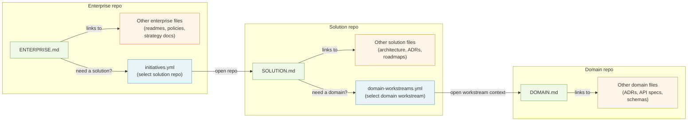

# Proposal: Multi-Level Repository Navigation and Routing Convention

Status: Draft
Audience: standards/community contributors, platform/tool builders, enterprise architecture teams
Scope: Multi-repository human and agent collaboration across enterprise, solution, domain, and implementation execution contexts

## 1. Problem

`AGENTS.md` is strong for repo-local behavior, but enterprise delivery spans multiple repositories and architecture levels.
At scale, teams need:

1. Level-aware entrypoints.
2. Deterministic cross-repository routing.
3. Explicit ownership, governance, and failure behavior.

This proposal addresses these needs with level entrypoints (Layer A) and optional routing catalogs for automation (Layer B).

## 2. Proposed Solution

This proposal is the solution to the problem in Section 1: it keeps repo-local guidance lightweight and human-friendly, while still enabling deterministic cross-repository routing for automation when needed.

### Guiding Principle: Progressive Disclosure Across Repositories

This proposal applies progressive disclosure at every scale instead of piling everything into one repository and one file:

1. **Repository level** (Layer B, when present): routing catalogs (`initiatives.yml`, `domain-workstreams.yml`, `domain-implementations.yml`) disclose the next stable target and, when needed, the exact workstream context to open. Resolution is deterministic -- you either resolve the selector or fail closed (see Section 5.5).
2. **File level** (Layer A): entrypoints disclose *what matters* in that repo. They are maps, not encyclopedias.
3. **Artifact level**: linked catalogs and design files disclose *the detail* -- only when you follow the link.

Each layer reveals only what is relevant at that layer. Where routing catalogs exist, they are simply the coarsest grain of disclosure.

To implement this principle, the proposal defines two independent layers (adoptable separately):

1. **Layer A: Entrypoint Convention**
   1. Purpose: human/agent navigation and context discovery.
   2. Tooling dependency: none.
2. **Layer B: Routing Catalog Specification (optional)**
   1. Purpose: deterministic machine routing between levels (for example Enterprise repo to Solution repo to Domain repo).
   2. Tooling dependency: a tool-capable consumer is required, such as an agent, script, IDE integration, or orchestration runtime.

An organization can adopt Layer A without Layer B, but conformance profiles start at routed adoption.

Catalogs at a glance:

```yaml
# initiatives.yml
version: "1.0"
initiatives:
  - { initiative_id: init-example, solution_repo_url: https://github.com/example/solution-repo, solution_entrypoint: SOLUTION.md, solution_git_ref: main, status: active }
```

```yaml
# domain-workstreams.yml
version: "1.0"
workstreams:
  - { workstream_id: ws-init-example-order, initiative_id: init-example, domain_id: order, workstream_entrypoint: inputs/workstreams/ws-init-example-order/WORKSTREAM.md, workstream_git_ref: feature/ws-init-example-order, domain_repo_url: https://github.com/example/order-domain-repo, status: active }
```

```yaml
# domain-implementations.yml
spec_name: multi-scale-routing
spec_version: "1.0.0"
implementations:
  - { implementation_id: order-api, status: active, repo: { paths: ["src/order-api/*"] } }
```



## 3. Layer A: Entrypoint Convention

### 3.1 Entrypoint Files

1. `AGENTS.md` (existing agents.md standard; unchanged).
2. `ENTERPRISE.md` (enterprise-level entrypoint).
3. `SOLUTION.md` (solution-level entrypoint).
4. `DOMAIN.md` (domain-level entrypoint).

This convention defines three architecture levels (`ENTERPRISE.md`, `SOLUTION.md`, `DOMAIN.md`) plus an implementation execution role (`dev`). `dev` is not a fourth architecture level and does not introduce a `DEV.md` entrypoint or a separate top-level routing catalog.

### 3.2 Entrypoint Rules

1. `AGENTS.md` remains the repo-local behavior contract.
2. The level entrypoint for a repository SHOULD exist when that level is present.
3. Entrypoints SHOULD stay concise and link to canonical machine artifacts instead of duplicating mutable data. This is especially important when catalogs are generated -- the entrypoint links to the artifact; it does not replicate it.
4. Upstream entrypoint links MUST be deterministic and level-explicit: `SOLUTION.md` MUST include an `ENTERPRISE.md` link when the enterprise level exists; `DOMAIN.md` MUST include an `ENTERPRISE.md` link when the enterprise level exists. `DOMAIN.md` MUST NOT require `SOLUTION.md` links for upstream navigation because solution-to-domain associations are many-to-many and can change over time; those associations belong in routing catalogs and handoff artifacts, not in Markdown ancestry.
5. When routing catalogs exist, downstream target information MUST be maintained in the canonical YAML catalogs (`initiatives.yml`, `domain-workstreams.yml`, `domain-implementations.yml`). Entrypoints MAY include lightweight navigation links, but SHOULD avoid duplicating exhaustive downstream mappings to prevent drift.
6. If no upstream level exists, the Parent section MUST state `Not applicable`.
7. Agents MUST start with `AGENTS.md`. `AGENTS.md` MUST instruct agents to always read the repository's level entrypoint (`ENTERPRISE.md`, `SOLUTION.md`, or `DOMAIN.md`) for architectural context and navigation. The canonical instruction form is: `Always read <LEVEL>.md`.

Implementation references:

1. AGENTS handoff templates: [AGENTS.ea.md.template](skills/ea-convention/templates/AGENTS.ea.md.template), [AGENTS.sa.md.template](skills/ea-convention/templates/AGENTS.sa.md.template), [AGENTS.da.md.template](skills/ea-convention/templates/AGENTS.da.md.template)
2. Level entrypoint templates: [ENTERPRISE.md.template](skills/ea-convention/templates/ENTERPRISE.md.template), [SOLUTION.md.template](skills/ea-convention/templates/SOLUTION.md.template), [DOMAIN.md.template](skills/ea-convention/templates/DOMAIN.md.template)
3. Core profile overview: [examples/core/README.md](examples/core/README.md)
4. Governed profile overview: [examples/governed/README.md](examples/governed/README.md)
5. Representative core artifacts: [examples/core/enterprise-repo/ENTERPRISE.md](examples/core/enterprise-repo/ENTERPRISE.md), [examples/core/enterprise-repo/initiatives.yml](examples/core/enterprise-repo/initiatives.yml), [examples/core/solution-repo/SOLUTION.md](examples/core/solution-repo/SOLUTION.md), [examples/core/solution-repo/domain-workstreams.yml](examples/core/solution-repo/domain-workstreams.yml), [examples/core/domain-repo/DOMAIN.md](examples/core/domain-repo/DOMAIN.md), [examples/core/domain-repo/domain-implementations.yml](examples/core/domain-repo/domain-implementations.yml)

Repository-local bounded-context guidance note:

1. In a Domain repository, `AGENTS.md` SHOULD reinforce that the repository is a bounded context. A concise pattern is: `You are operating strictly inside the <Domain Name> bounded context. Never modify or reference artifacts owned by another domain without escalation through the authoritative routing or governance artifacts.`

Example traversal:

1. Read `AGENTS.md`.
2. Open the level entrypoint named by that repo's startup instruction.
3. Use the canonical selector catalog for the next boundary instead of searching by repo name.
4. Open the resolved target repository and entrypoint.
5. Re-anchor on the target repository's local `AGENTS.md` before continuing.

### 3.3 Parent Link Format

Accepted parent link forms:

1. Absolute HTTPS URL to parent entrypoint file.
2. Repository-relative path when parent is in the same repository.
3. Stable repository identifier plus path (when URL is resolved at runtime).
4. The Parent section SHOULD label upstream links by level (for example `ENTERPRISE`).

Identifier note:

1. A stable repository identifier SHOULD be provider-qualified and durable (for example `github:example-org/ea-repo`).
2. Example parent reference: `github:example-org/ea-repo#/ENTERPRISE.md`.

### 3.4 Role Semantics

The repository model implies four common working roles:

1. `ea`: enterprise architecture. Owns cross-solution portfolio navigation, enterprise-level routing semantics, and enterprise governance artifacts.
2. `sa`: solution architecture. Owns solution-level decomposition, workstream routing, and solution-scoped coordination across domains.
3. `da`: domain architecture. Owns domain boundaries, domain design baselines, and the authoritative mapping from `implementation_id` to implementation targets.
4. `dev`: implementation execution role operating within the scope defined by `da`. `dev` consumes domain context and implementation targets but does not define a new architecture layer.

Bounded-context contract:

1. `DOMAIN.md` plus `domain-implementations.yml` define the canonical bounded-context contract for a domain.
2. This contract SHOULD make the domain's ubiquitous language, invariants, authoritative interfaces, and implementation targets explicit.
3. Domain-to-domain relationships MUST be expressed through domain-owned artifacts such as entrypoints, schemas, APIs, or other authoritative references. They MUST NOT be inferred from repository adjacency, naming similarity, or incidental code references.
4. `da` owns this contract. `dev` executes within it.

Normative `dev` semantics:

1. `dev` is subordinate to `da` for architectural context. The canonical upstream architecture contract for `dev` is `DOMAIN.md`, the authoritative `domain-implementations.yml`, and any domain-owned artifacts explicitly linked from that domain context.
2. The ownership boundary is defined by artifacts, not by the specific human, agent, or tool performing the work. `da` owns the design contract artifacts, including domain interfaces, schemas, and implementation specifications. `dev` owns implementation-local artifacts such as working code, tests, build files, service-local documentation, and repo-local `AGENTS.md` behavior in the implementation repository.
3. `da` ownership remains authoritative for domain-level artifacts such as `DOMAIN.md`, `domain-implementations.yml`, and domain design baselines. `dev` MUST NOT treat implementation-local documentation as an override of those domain artifacts.
4. `dev` traversal is read-down, execute-locally. A `dev` actor MAY consume upstream architectural artifacts for implementation context, but MUST NOT write back into `da`-owned artifacts as part of normal implementation flow. If coding work reveals a gap, ambiguity, or defect in a `da` artifact, that condition MUST be escalated to the owning architectural layer rather than patched in place by `dev`.
5. `dev` does not add a new mandatory catalog. Domain-to-implementation traversal remains the boundary between architecture and execution.
6. `dev` does not consume `sa` artifacts directly by default. Direct consumption of `sa`-owned artifacts is allowed only when the relevant `da` artifact explicitly links or delegates to those upstream artifacts as part of the domain contract.
7. The explicit `da` link or delegation mechanism is implementation-defined, but MUST be represented by an authoritative reference in a `da`-owned artifact. Acceptable mechanisms include a stable Markdown link from `DOMAIN.md` or a canonical field in a domain-owned YAML artifact. Implicit knowledge, chat history, or tool-specific workspace state is not sufficient.
8. These `dev` rules are tool-agnostic. Any coding agent or implementation actor operating at this layer, including tools such as Codex, Cursor, Copilot, or equivalent systems, is subject to the same traversal and ownership constraints.
9. If one team performs both `da` and `dev`, the repository MAY collapse the roles operationally, but the ownership boundary between domain-level artifacts and implementation-local artifacts SHOULD still be made explicit. Common mechanisms include separate directories, CODEOWNERS/file ownership rules, or an ownership table in the relevant entrypoint.

### 3.5 Minimal Entrypoint Examples

#### ENTERPRISE.md (minimal)

```markdown
# ENTERPRISE

Purpose: Enterprise portfolio entrypoint.

## Read First
1. This file — enterprise context and navigation

## Parent
Not applicable

## Canonical Artifacts
- initiatives.yml
- domain-registry.yml
```

#### SOLUTION.md (minimal)

```markdown
# SOLUTION

Purpose: Solution architecture entrypoint.

## Read First
1. This file — solution context and navigation

## Parent
- [ENTERPRISE](https://github.com/example/ea-repo/blob/main/ENTERPRISE.md)

## Canonical Artifacts
- domain-workstreams.yml
- solution-index.yml
```

#### DOMAIN.md (minimal)

```markdown
# DOMAIN

Purpose: Domain architecture entrypoint.

## Read First
1. This file — domain context and navigation

## Parent
- [ENTERPRISE](https://github.com/example/ea-repo/blob/main/ENTERPRISE.md)

## Canonical Artifacts
- domain-implementations.yml
```

## 4. Bootstrap Discovery (Core for Routed Profiles)

For routed profiles (Core/Governed), implementations MUST provide at least one deterministic bootstrap mechanism that resolves the topmost level present in the organization:

1. Explicit startup parameter.
2. Environment variable.
3. Well-known discovery endpoint.

The bootstrap target is the highest-level repository in the routing chain (enterprise repo for three-level organizations, solution repo for two-level organizations). Implementations MUST document which mechanism is authoritative.

## 5. Layer B: Routing Catalog Specification

Path placement is intentionally implementation-defined.
This standard defines file names and semantics, not fixed directories.

### 5.1 Canonical Catalog Set

| Catalog | Level | Selector | Resolves |
|---|---|---|---|
| `initiatives.yml` | Enterprise | `initiative_id` | `solution_repo_url` + `solution_entrypoint` + `solution_git_ref` |
| `domain-workstreams.yml` | Solution | `workstream_id` | workstream context (see Section 5.3) |
| `domain-implementations.yml` | Domain | `implementation_id` | repo location + optional entrypoint/ref |

Catalog resolution is defined per boundary. This specification does not guarantee automatic selector propagation across boundaries; the caller must possess or obtain the selector for the next boundary independently. Implementations MAY define handoff mechanisms that carry selectors across boundaries, but such mechanisms are implementation-specific.

Format rules:

1. YAML is the canonical format for all catalogs in this proposal.

Catalog intent at a glance:

```yaml
# enterprise to solution
version: "1.0"
initiatives:
  - initiative_id: init-bss-modernization
    solution_repo_url: https://github.com/acme/solution-bss
    solution_entrypoint: SOLUTION.md
    solution_git_ref: main
    status: active
```

```yaml
# solution to domain handoff
version: "1.0"
workstreams:
  - workstream_id: ws-bss-order
    initiative_id: init-bss-modernization
    domain_id: order
    workstream_entrypoint: inputs/workstreams/ws-bss-order/WORKSTREAM.md
    workstream_git_ref: feature/ws-bss-order
    domain_repo_url: https://github.com/acme/domain-order
    status: active
```

```yaml
# domain to implementation target
spec_name: multi-scale-routing
spec_version: "1.0.0"
implementations:
  - implementation_id: order-api
    status: active
    repo:
      paths: ["src/order-api/*"]
```

Authorship note: Routing catalogs are typically generated artifacts -- produced by an intake pipeline that filters a richer source (for example `initiative-pipeline.yml`) and writes the selector manifest. Because they are generated, they must remain separate from the human-authored entrypoint (`ENTERPRISE.md`). Inlining them into the entrypoint would either make the entrypoint a generated file (conflicting with its role as a stable navigation guide) or introduce a hand-maintained duplicate that drifts from the pipeline source.

### 5.2 Versioning Contract

Catalog headers MUST follow the canonical schema for that catalog type:

1. `initiatives.yml` MUST include `version`.
2. `domain-workstreams.yml` MUST include `version`.
3. `domain-implementations.yml` MUST include `spec_name` and `spec_version`.
4. Governed companion artifacts with authoritative schemas in this repository follow the same header discipline:
   1. `domain-registry.yml` MUST include `version`.
   2. `solution-index.yml` MUST include `version`.

Version rules:

1. `MAJOR`: breaking change.
2. `MINOR`: backward-compatible additive change.
3. `PATCH`: backward-compatible clarification/fix.

Runtime behavior:

1. Consumers MUST fail closed on unknown `MAJOR` versions.
2. Producers MUST provide migration notes when incrementing `MAJOR`.

Authoritative machine-readable schemas for canonical catalog validation are maintained under `skills/ea-convention/references/`. These schemas define structural validation for canonical catalogs and are versioned alongside the catalog version contract in this section. Topology-dependent conditions from Sections 5.3, 5.5, and 9 remain normative validator rules in addition to standalone schema validation because they depend on the surrounding artifact set.
Appendix A lists the schema file paths, schema identifiers, and intended purpose for each canonical schema without duplicating schema structure in Markdown.

### 5.3 Minimum Fields

Cross-repo target fields:

Rationale for implementation target metadata:

Some organizations keep a first-party Domain repo as the canonical architecture overlay while adopting third-party or open-source repositories as implementation targets. In that model, repo-only resolution is not sufficient for deterministic agent navigation because the external repository may not implement this convention and may expose multiple plausible entry files. Optional implementation target metadata therefore allows the Domain repo to declare both the exact file an agent should open and, when needed, the revision the architecture was validated against, without requiring any change to the external repository itself.

1. `initiatives.yml` entries MUST include `solution_entrypoint` (for example `SOLUTION.md`) and `solution_git_ref` alongside `solution_repo_url`.
2. When `domain-registry.yml` entries include `domain_repo_url`, they MUST include `domain_entrypoint` (for example `DOMAIN.md`) and `domain_git_ref`.
   `solution_git_ref` and `domain_git_ref` identify the concrete repository revision used for deterministic routing and entrypoint validation at those boundaries.
3. `domain-workstreams.yml` entries MUST include `domain_id`, `workstream_entrypoint`, and `workstream_git_ref`.
   When the enterprise level exists (i.e., `initiatives.yml` is present), entries MUST also include `initiative_id` to link the workstream to its originating initiative. When no enterprise level exists (two-level topology per Section 12.2), `initiative_id` MAY be omitted.
   `initiative_id`, when present, enables correlation between workstreams and initiatives but does not create a normative routing step; the canonical selector for `domain-workstreams.yml` remains `workstream_id`.
   `domain_id` is the stable target identity, the canonical DA runtime and session identity (see Section 5.7.3), and remains required even when `domain_repo_url` is sufficient for self-sufficient runtime resolution in topologies without an authoritative domain registry. Multiple workstreams from different initiatives MAY reference the same `domain_id`; this many-to-one relationship does not imply multiple DA runtime ownership boundaries.
4. `domain-workstreams.yml` entries MUST include `domain_repo_url` unless the runtime has access to an authoritative `domain-registry.yml` that can resolve `domain_id` to the stable domain repository. In topologies without an authoritative domain registry, `domain_repo_url` in `domain-workstreams.yml` is the self-sufficient repository target for the owning domain. When `domain_repo_url` is omitted under this rule, implementations MUST interpret `workstream_entrypoint` and `workstream_git_ref` relative to the authoritative `domain_repo_url` resolved from `domain-registry.yml`.
5. `workstream_entrypoint` MAY be `null` while the workstream context has not yet been materialized. For any routable workstream status, `workstream_entrypoint` MUST be non-null.
6. `domain-workstreams.yml` entries MAY include `workstream_path` to identify the repo-relative folder that contains the workstream artifacts.
7. `domain-implementations.yml` entries MUST include:
   1. `implementation_id`: stable primary key. MUST be unique within the catalog. MUST NOT change even if the underlying repository is renamed, moved, or split.
   2. `status`: lifecycle state from the vocabulary defined in Section 5.4.
8. `domain-implementations.yml` entries MUST include a `repo` object with the following fields:
   1. `repo.url`: canonical VCS repository URL. Optional; when omitted, defaults to the repository that contains the catalog file (monorepo case). When present, MUST be a non-empty, canonicalized URL; null or empty string is a schema validation error (`ERR_INVALID_SCHEMA`).
   2. `repo.paths`: list of glob patterns scoping the implementation within the repository. Optional; when omitted, defaults to `["*"]` (whole repository). When present, MUST be a non-empty list of non-empty glob strings.
   3. `repo.aliases`: list of previous canonical URLs retained during a rename grace window. Optional. Aliases participate in the uniqueness invariant and in repo-first resolution. Implementations SHOULD enforce an alias sunset policy.
   4. `repo.entrypoint`: repo-relative file path to open after resolving the target repository. Optional. When present, MUST be a non-empty path string. Implementations SHOULD provide this field whenever deterministic file-level navigation into the target repository is required, especially for external or third-party repositories that do not follow this convention.
   5. `repo.git_ref`: branch, tag, or commit ref identifying the expected target revision. Optional. When present, MUST be a non-empty string. For external or third-party repositories with mutable default branches, implementations SHOULD prefer a release tag or commit SHA.
9. `domain-implementations.yml` uniqueness invariant: for each entry, every pair `(canonical(repo.url), matched repo.path)` MUST map to exactly one `implementation_id`. `paths: ["*"]` may appear at most once per `repo.url` and MUST NOT coexist with other entries for the same `repo.url`. The set `{repo.url} ∪ repo.aliases` participates in the invariant; no other entry may overlap on any member of that set.
10. `domain-implementations.yml` lifecycle fields (optional):
    1. `valid_from`, `valid_to`: ISO 8601 dates bounding the active window.
    2. `replaced_by`: list of `implementation_id` values identifying successor entries (for split, merge, or replacement). Referenced entries MUST exist in the catalog.
11. `domain-implementations.yml` traceability fields (optional, not used for routing):
    1. `workstream_id`: the workstream currently handling changes to this implementation. Transient; MAY be null.
    2. `initiative_id`: originating initiative. When present, MUST be consistent with the corresponding `domain-workstreams.yml` and `initiatives.yml` entries.
    3. `owners`: list of team or individual owners.
    4. `metadata`: free-form extension map for industry- or organisation-specific annotations.

#### initiatives.yml

```yaml
version: "1.0"
initiatives:
  - initiative_id: init-example
    solution_repo_url: https://github.com/example/solution-repo
    solution_entrypoint: SOLUTION.md
    solution_git_ref: main
    status: active
```

#### domain-workstreams.yml

```yaml
version: "1.0"
workstreams:
  - workstream_id: ws-init-example-order
    initiative_id: init-example
    domain_id: order
    workstream_entrypoint: inputs/workstreams/ws-init-example-order/WORKSTREAM.md
    workstream_git_ref: feature/ws-init-example-order
    domain_repo_url: https://github.com/example/order-domain-repo
    workstream_path: inputs/workstreams/ws-init-example-order/
    status: active
```

#### domain-implementations.yml

```yaml
spec_name: multi-scale-routing
spec_version: "1.0.0"
implementations:
  # Monorepo — repo.url omitted (defaults to catalog repo), scoped paths
  - implementation_id: order-api
    status: active
    repo:
      paths: ["src/order-api/*"]

  # Multi-repo — explicit url, multiple paths
  - implementation_id: payments-risk-service
    status: active
    repo:
      url: https://github.com/example/payments-risk
      paths:
        - services/risk/*
        - batch/risk-jobs/*
      entrypoint: services/risk/README.md
      git_ref: main
    # traceability (optional)
    workstream_id: ws-init-example-payments
    owners: [payments-team]

  # Adopted upstream — external repo with deterministic file target
  - implementation_id: identity-keycloak-upstream
    status: active
    repo:
      url: https://github.com/keycloak/keycloak
      paths: ["*"]
      entrypoint: README.md
      git_ref: 26.1.0
    # traceability (optional)
    owners: [identity-architecture]

  # Deprecated — replaced by successors
  - implementation_id: payments-legacy
    status: deprecated
    valid_to: "2026-12-31"
    replaced_by: [payments-risk-service]
    repo:
      url: https://github.com/example/payments-legacy
      aliases:
        - https://github.com/example/old-payments
      paths: ["*"]
```

Monorepo path-scoping example:

```yaml
spec_name: multi-scale-routing
spec_version: "1.0.0"
implementations:
  - implementation_id: order-api
    status: active
    repo:
      paths: ["apps/order-api/*"]
      entrypoint: apps/order-api/README.md
  - implementation_id: order-worker
    status: active
    repo:
      paths: ["apps/order-worker/*"]
      entrypoint: apps/order-worker/README.md
```

In this pattern, `repo.url` is omitted because both implementations live in the same repository as the catalog. Deterministic routing is preserved by non-overlapping `repo.paths`.

### 5.4 Status Vocabulary (Normative)

Allowed values:

1. `active`
2. `approved`
3. `ready`
4. `in_progress`
5. `paused`
6. `completed`
7. `archived`
8. `deprecated`
9. `inactive`

Semantics:

1. `active`: routable.
2. `approved`: not routable by default; work has been authorized but not yet started.
3. `ready`: not routable by default; work is staged and ready to begin.
4. `in_progress`: routable; work is actively underway.
5. `paused`: non-routable by default; resumable by policy.
6. `completed`: read-only historical.
7. `archived`: historical, usually not in active selector views.
8. `deprecated`: read-only tombstone; never routable for write operations. Resolvers MAY resolve and emit a `deprecated_target` warning. Entries SHOULD include `replaced_by` when successors exist.
9. `inactive`: explicitly removed from routing. Non-routable; resolvers MUST fail closed with `ERR_SELECTOR_NOT_ROUTABLE`. Unlike `archived`, `inactive` entries MAY return to `active`.

Routable by default: `active`, `in_progress`.

Not all statuses apply equally to every catalog. For example, `in_progress` is typical for workstreams and initiatives; `domain-implementations.yml` entries typically use `active`, `deprecated`, and `inactive`.

Implementations MAY extend the routable set to include `approved` and/or `ready` by explicit configuration. Implementations that extend the routable set MUST declare the effective routable statuses in configuration or runtime metadata so that consumers can determine the active routing mask without implementation-specific knowledge.

### 5.5 Routing Policy

1. Fail closed on missing selector ID (`ERR_SELECTOR_MISSING`).
2. Fail closed on ambiguous selector ID (`ERR_SELECTOR_AMBIGUOUS`).
3. Fail closed on non-routable status by default (`ERR_SELECTOR_NOT_ROUTABLE`).
4. Cross-file references that participate in routing or entrypoint navigation MUST resolve against the authoritative artifact set for the current topology when that artifact set is available to the resolver or validator. An unresolved or dangling reference is an invalid convention state and MUST fail closed.
5. At minimum, the following references MUST resolve when the corresponding artifacts are present and available to the resolver or validator:
   1. `domain-workstreams.yml[].initiative_id` -> `initiatives.yml[].initiative_id`
   2. `domain-workstreams.yml[].domain_id` -> `domain-registry.yml[].domain_id`
   3. `solution_entrypoint` / `domain_entrypoint` / `workstream_entrypoint` / `repo.entrypoint` -> a real file in the referenced repository/revision when the corresponding entrypoint field is non-null. The applicable revision field is `solution_git_ref`, `domain_git_ref`, `workstream_git_ref`, or `repo.git_ref` as appropriate.
6. Implementations MUST NOT fall back to repo-name heuristics, keyword search, or other inferred context.
7. Deprecated targets are read-only discovery targets. A resolver MAY return a deprecated entry for traceability or migration context, but MUST NOT route write operations through it.
8. When a deprecated entry includes `replaced_by`, the resolver SHOULD surface those successor `implementation_id` values as migration hints. These hints do not override the fail-closed requirement for write routing.
9. Redirect behavior is explicit only. Implementations MUST NOT infer replacements unless they are declared in the authoritative catalog.

These error semantics are normative for all routing behavior, regardless of whether the optional machine access contract (Section 5.8) is implemented. How implementations surface these errors (structured error objects, exceptions, log entries) is implementation-defined; the behavioral requirement to fail closed is not.

### 5.6 Selector Uniqueness

1. Each selector field MUST be independently unique within a catalog.
2. When a catalog defines `implementation_id` in `domain-implementations.yml`, each value MUST be unique within that catalog.
3. Implementations MUST fail closed on duplicate selector values.

### 5.7 DA Runtime Identity and Workstream Semantics

#### 5.7.1 Domain-Workstream Relationship

1. A workstream is a solution-scoped inbound demand unit against a domain. It carries handoff context for a specific initiative or change stream, but it does not define a distinct Domain Architecture ownership boundary.
2. `workstream_id` remains the canonical selector for `domain-workstreams.yml` and identifies the inbound Solution Architecture to Domain Architecture handoff.
3. `domain_id` identifies the stable owning domain target for the workstream and is required even when `domain_repo_url` is sufficient for self-sufficient runtime resolution in topologies without an authoritative domain registry.
4. Multiple `workstream_id` values from different initiatives MAY reference the same `domain_id`.
5. This many-to-one relationship does not imply multiple Domain Architecture runtime ownership boundaries. Workstreams are inbound demand units; domain ownership remains anchored on `domain_id`.

#### 5.7.2 `domain_repo_url` Semantics at the Solution-Domain Boundary

1. `domain_repo_url` identifies the repository location of the owning domain target for the workstream.
2. `domain_repo_url` in `domain-workstreams.yml` does not imply a unique Domain Architecture runtime or session per workstream; it identifies the shared domain-owned repository target.
3. When authoritative `domain-registry.yml` is absent, `domain_repo_url` in `domain-workstreams.yml` provides self-sufficient runtime resolution for the Solution to Domain boundary.
4. When authoritative `domain-registry.yml` is present, `domain_repo_url` in `domain-workstreams.yml` MAY be omitted. If it is present, it is redundant and MUST match the authoritative registry value for the same `domain_id`.

#### 5.7.3 DA Runtime Identity

1. Domain Architecture runtime ownership is domain-scoped.
2. The canonical runtime and session identity for a Domain Architecture owner is `domain_id`.
3. A runtime MAY accept a `workstream_id` handoff as input, but it MUST map that handoff to the owning `domain_id` before establishing or reusing long-lived Domain Architecture session continuity.
4. Implementations SHOULD preserve the originating `workstream_id` as inbound context associated with the domain-scoped session.

#### 5.7.4 Validation Stages

1. Implementations MAY perform an initial planning or discovery validation using handoff-visible catalogs or derived reports.
2. Planning or discovery validation is not authoritative for final Domain Architecture target resolution.
3. Final startup validation MUST resolve the authoritative domain target from `domain-registry.yml` when that registry is present in the operating model.
4. If planning validation and authoritative startup validation disagree, implementations MUST fail closed at startup.

#### 5.7.5 Runtime Metadata

1. Implementations SHOULD avoid overloaded generic runtime metadata fields such as `repo_url` on domain-scoped Domain Architecture rows unless their meaning is explicitly documented.
2. If runtime metadata is derived from `domain-workstreams.yml[].domain_repo_url`, it MUST be interpreted as the domain-owned repository target for that `domain_id`, not as a workstream-scoped runtime identity.
3. `domain_repo_url` remains the authoritative domain-owned runtime target when Domain Architecture runtime identity is domain-scoped.

### 5.8 Optional Machine Access Contract

Implementations MAY expose machine access surfaces over canonical routing catalogs.

This section defines query semantics only. Transport, invocation syntax, authentication, programming language, and deployment model are implementation-defined.

Contract rules:

1. Required operations:
   1. `resolve`: return a single entry by canonical selector type and selector value.
   2. `list`: return entries for a catalog, optionally filtered by exact-match status.
   3. `validate`: report catalog integrity against the minimum checks in Section 7.
2. Input contract:
   1. `resolve` inputs MUST include a canonical selector type and selector value.
   2. `list` inputs MAY include a catalog identifier and exact-match status filter.
   3. Implementations MUST NOT require fuzzy search, keyword search, or inferred selector aliases for core resolution behavior.
3. Output contract:
   1. `resolve` responses MUST include the canonical fields required for that catalog type under Section 5.3.
   2. `list` responses MUST preserve canonical entry semantics for every returned entry.
   3. Implementations MAY add metadata or extension fields if canonical fields remain present and unmodified.
4. Error contract:
   1. Structured errors MUST include an `error_code`.
   2. Implementations MUST support at least `ERR_SELECTOR_MISSING`, `ERR_SELECTOR_AMBIGUOUS`, and `ERR_SELECTOR_NOT_ROUTABLE`.
   3. Implementations MAY also emit other error codes from Section 11 when applicable.
5. Conflict rule:
   1. Canonical YAML remains authoritative.
   2. Implementations MUST NOT return results whose canonical semantics contradict the authoritative YAML content.
6. Freshness rule:
   1. Implementations MUST either return results consistent with the current authoritative YAML revision or explicitly declare the revision or staleness boundary represented by the response.

Companion guidance and example realization patterns belong in `reference/machine-access-contract.md`.

## 6. Compatibility and Alias Policy

Canonical keys:

1. `workstreams[]` + `workstream_id`
2. `implementations[]` + `implementation_id`

Migration policy:

1. Writers MUST emit canonical keys.
2. Readers SHOULD enforce canonical keys for deterministic behavior.
3. Legacy aliases are out of scope for this draft baseline.

## 7. Validation Requirements

Validators for this convention MUST check:

1. structural schema and required-field conformance using the authoritative schemas under `skills/ea-convention/references/`
2. topology-dependent conditional conformance from Sections 5.3 and 9 that depends on the surrounding artifact set (for example when `initiative_id` or `domain_repo_url` is required)
3. selector uniqueness (see Section 5.6)
4. cross-file reference integrity for all normative references in Section 5.5
5. status-policy compliance
6. catalog version compatibility against Section 5.2

When the referenced repository or revision is accessible to the validator, it SHOULD also check:

1. referenced repository URLs are reachable with validator identity (or provider API equivalent)
2. referenced entrypoint paths exist in the target repository/revision declared by `solution_git_ref`, `domain_git_ref`, `workstream_git_ref`, or `repo.git_ref` as applicable

Companion operational guidance, including CI realization patterns and observability practices, is maintained in `reference/operational-guidance.md`.

## 8. Ownership Model

| Artifact | Recommended owner | Primary purpose |
|---|---|---|
| `AGENTS.md` | repository owners | repo-local agent behavior contract |
| `ENTERPRISE.md` | EA | enterprise context entrypoint |
| `SOLUTION.md` | SA | solution context entrypoint |
| `DOMAIN.md` | DA | domain context entrypoint |
| `initiatives.yml` | EA/PMO | enterprise->solution routing |
| `domain-workstreams.yml` | SA | solution->domain routing |
| `domain-implementations.yml` | DA | domain->implementation routing |
| implementation repo local artifacts | Dev | implementation execution within DA-defined target scope |
| governance state artifact | governance + level owners | stage gates and progress |

Override rule:

1. If roles are collapsed in one team/repository, ownership MUST be explicitly declared in the relevant entrypoint.

## 9. Conformance Profiles

Routed adoption means deterministic selector-based resolution at each architecture boundary that exists in the operating model.

### Core Profile

Checklist:

1. `AGENTS.md` plus the applicable level entrypoints exist for the levels in scope.
2. A deterministic bootstrap discovery mechanism exists for the topmost level present in the organization.
3. `initiatives.yml` exists when both enterprise and solution levels exist.
4. `domain-workstreams.yml` exists when both solution and domain levels exist.
5. `domain-implementations.yml` exists when selector-driven domain-to-implementation routing is in scope.

A two-level organization (for example Solution + Domain only) satisfies the Core profile with `domain-workstreams.yml` for solution->domain workstream routing. It requires `domain-implementations.yml` only when selector-driven domain->implementation routing is in scope. Catalogs for absent boundaries are not required.

Core profile resolution rule:

1. `domain-workstreams.yml` MUST be self-sufficient for runtime resolution when no authoritative `domain-registry.yml` is available.
2. In that case, each workstream entry MUST include `domain_repo_url`.
3. When an authoritative `domain-registry.yml` is available at runtime, `domain_repo_url` MAY be omitted and `domain_id` is resolved through the registry.

### Governed Profile

Checklist:

1. Core profile requirements are satisfied.
2. A domain governance registry exists, for example `domain-registry.yml`.
3. When a domain registry entry includes `domain_repo_url`, it also includes `domain_entrypoint` and `domain_git_ref`.
4. A solution scope or index manifest exists, for example `solution-index.yml`.
5. A governance state artifact exists with minimum fields `spec_name`, `spec_version`, and `layers`.

Governance layer status values are separate from the routing status vocabulary in Section 5.4. Allowed governance layer statuses: `not_started`, `in_progress`, `proposed`, `approved`, `blocked`, `rejected`.

Minimal example:

```yaml
spec_name: governance-state
spec_version: "1.0.0"
layers:
  requirements:
    status: approved
    approved_by: product-owner
    approved_at: "2026-02-28T10:00:00Z"
  solution_architecture:
    status: in_progress
  domain_architecture:
    status: not_started
```

## 10. Conflict Resolution and Precedence

Precedence by concern:

1. Agent behavior/security constraints: `AGENTS.md` wins.
2. Routing and target resolution: routing catalogs win.
3. Narrative/context descriptions: level entrypoint (`ENTERPRISE.md`/`SOLUTION.md`/`DOMAIN.md`) wins.

If two artifacts conflict within the same concern domain:

1. Runtime MUST fail closed.
2. Runtime MUST emit a structured conflict error event.

## 11. Error Codes

Implementations that surface structured routing or validation failures MUST support the following error codes when applicable:

1. `ERR_SELECTOR_MISSING`
2. `ERR_SELECTOR_AMBIGUOUS`
3. `ERR_SELECTOR_NOT_ROUTABLE`
4. `ERR_TARGET_UNREACHABLE`
5. `ERR_ACCESS_DENIED`
6. `ERR_PARENT_LINK_MISSING`
7. `ERR_CONFLICT`
8. `ERR_INVALID_SCHEMA`: catalog entry has structural errors (for example null or empty `repo.url` when the key is present, empty `repo.paths` list).
9. `ERR_OVERLAPPING_PATHS`: two or more `domain-implementations.yml` entries produce overlapping `(repo.url, repo.path)` bindings, violating the uniqueness invariant.
10. `ERR_NO_CONTEXT`: no catalogs are loaded in the resolver's active context (repo-first cold-start with no Domain repo open).
11. `ERR_REFERENCE_UNRESOLVED`: a normative intra-repository or cross-repository reference does not resolve to an existing selector target or file.

Companion observability guidance, including suggested failure record fields and logging patterns, is maintained in `reference/operational-guidance.md`.

## 12. Partial Adoption Patterns

### 12.1 Single-Level Repository

1. Use `AGENTS.md` plus one level entrypoint.
2. Routing catalogs are optional.

### 12.2 Two-Level (Solution + Domain)

1. Use `SOLUTION.md` and `DOMAIN.md`.
2. Use routing catalogs only for boundaries that exist.
3. `ENTERPRISE.md` and `initiatives.yml` are optional.
4. In this topology, `DOMAIN.md` does not need a `SOLUTION.md` parent link. Solution-to-domain relationships remain many-to-many and are discovered from `domain-workstreams.yml` or equivalent handoff artifacts.

### 12.3 Three-Level (Enterprise + Solution + Domain)

1. Use full Layer A + Layer B for deterministic per-boundary routing at all three level boundaries.

## 13. Discovery and Traversal

Top-down per-boundary routing sequence (each step requires the caller to possess the selector for that boundary):

1. `initiative_id` -> `initiatives.yml` -> solution repository + `solution_entrypoint` + `solution_git_ref`
2. `workstream_id` -> `domain-workstreams.yml` -> `domain_id` + `workstream_entrypoint` + `workstream_git_ref`
3. Repository resolution for a workstream handoff and DA startup:
   1. self-sufficient target resolution: use `domain_repo_url` when present in `domain-workstreams.yml`
   2. authoritative target resolution fallback: when `domain_repo_url` is omitted and authoritative `domain-registry.yml` is present, resolve `domain_id` -> `domain_repo_url` and interpret `workstream_entrypoint` + `workstream_git_ref` there
   3. when both are available, `domain-registry.yml` remains authoritative and any duplicated `domain_repo_url` in `domain-workstreams.yml` MUST match it
4. `implementation_id` -> `domain-implementations.yml` -> repo location + optional `repo.entrypoint` + optional `repo.git_ref` (when selector-driven domain->implementation routing boundary exists)

Context mapping patterns:

1. Anti-corruption layer: when one domain consumes another through translation, the translating boundary SHOULD be declared in domain-owned artifacts rather than inferred from code structure.
2. Published language: when a domain exposes shared event, API, or schema vocabulary, agents SHOULD consume that published contract rather than reverse-engineer private implementation types.
3. Shared kernel: when two domains intentionally share a narrow model, the shared surface MUST be explicitly identified so agents do not widen the coupling implicitly.
4. Customer/supplier: when one domain depends on another's roadmap or contract, the dependency SHOULD be represented by authoritative upstream references and not by direct editing across repositories.

AI-first usage:

1. Tool-capable agents SHOULD start with `AGENTS.md`, then open the applicable level entrypoint, then use the canonical selector catalog for the next boundary.
2. For cross-level work, prompts and automation SHOULD name selectors and expected routing steps explicitly, for example: `Resolve initiative init-bss-modernization through initiatives.yml, then open the target SOLUTION.md.`
3. Domain-scoped execution SHOULD begin from `DOMAIN.md` and `domain-implementations.yml`, not from monorepo-wide search or guessed repository ownership.
4. This pattern reduces context-window waste because the agent opens the smallest authoritative artifact set needed for the current boundary instead of searching across unrelated repositories.
5. After crossing into a target implementation repository, the agent MUST re-anchor on that repository's local `AGENTS.md` before taking implementation-local actions.

Developer traversal semantics:

1. `dev` startup is anchored at the domain layer: `AGENTS.md` -> `DOMAIN.md` -> `domain-implementations.yml` -> target implementation repository and optional `repo.entrypoint`/`repo.git_ref`.
2. After the target implementation repository is opened, that repository's local `AGENTS.md` becomes the active repo-local behavior contract.
3. `dev` MAY read additional `da`-linked design contract artifacts such as interfaces, schemas, and implementation specifications before or during implementation. `sa` artifacts are in scope only when explicitly linked or delegated through the authoritative domain context.
4. `dev` traversal does not bypass `da` semantics. If an implementation repository lacks sufficient architecture context, the resolver SHOULD return to `DOMAIN.md` and the associated domain artifacts rather than infer intent from repository names or code structure alone.
5. `dev` MUST NOT treat reverse traversal as implicit write authority into upstream artifacts. Reverse traversal from implementation back to architecture is for traceability, context recovery, and escalation: `implementation_id` -> `domain-implementations.yml` -> `DOMAIN.md` -> upstream layers when needed.

Bottom-up discovery:

1. Domain agent reads `DOMAIN.md` upstream link to `ENTERPRISE.md` when the enterprise level exists.
2. If the enterprise level is absent, `DOMAIN.md` MAY have `Parent: Not applicable`; solution associations are still recovered from `domain-workstreams.yml` or equivalent handoff artifacts rather than Markdown parent links.
3. Solution agent reads `SOLUTION.md` parent link to `ENTERPRISE.md` when the enterprise level exists.
4. Agents MAY use shared IDs (`initiative_id`, `workstream_id`, `domain_id`) for partial lineage reconstruction when those IDs are present in catalog entries. End-to-end lineage from implementation artifact to business initiative is not guaranteed by the core catalog minimum fields (see Section 5.3).

## 14. Compatibility with agents.md

This proposal is additive:

1. `AGENTS.md` remains the base standard and is not replaced.
2. `ENTERPRISE.md`/`SOLUTION.md`/`DOMAIN.md` extend navigation for multi-scale repositories.
3. Routing catalogs are optional outside routed profiles.
4. Claude Code compatibility is achieved through `CLAUDE.md` bridging into this convention's repository flow; this proposal does not assume native Claude Code support for `AGENTS.md`.

Reference implementation layout, operational mapping patterns, agent context guidance, and adoption notes are maintained in companion documents under `reference/`.

## Appendix A. Canonical Schemas

| Schema file | `$id` | Purpose |
|---|---|---|
| [skills/ea-convention/references/initiatives.schema.json](skills/ea-convention/references/initiatives.schema.json) | `https://example.com/enterprise.md/schemas/initiatives.schema.json` | Structural validation for enterprise-to-solution routing catalogs |
| [skills/ea-convention/references/domain-workstreams.schema.json](skills/ea-convention/references/domain-workstreams.schema.json) | `https://example.com/enterprise.md/schemas/domain-workstreams.schema.json` | Structural validation for solution-to-domain workstream routing catalogs |
| [skills/ea-convention/references/domain-implementations.schema.json](skills/ea-convention/references/domain-implementations.schema.json) | `https://example.com/enterprise.md/schemas/domain-implementations.schema.json` | Structural validation for domain-to-implementation routing catalogs |
| [skills/ea-convention/references/domain-registry.schema.json](skills/ea-convention/references/domain-registry.schema.json) | `https://example.com/enterprise.md/schemas/domain-registry.schema.json` | Structural validation for governed-profile domain registries |
| [skills/ea-convention/references/solution-index.schema.json](skills/ea-convention/references/solution-index.schema.json) | `https://example.com/enterprise.md/schemas/solution-index.schema.json` | Structural validation for governed-profile solution manifests |

The repository also contains [skills/ea-convention/references/domain-roadmap.schema.json](skills/ea-convention/references/domain-roadmap.schema.json) with `$id` `https://example.com/enterprise.md/schemas/domain-roadmap.schema.json`. It is intentionally excluded from the canonical table above because `domain-roadmap.yml` is a proposed extension, not part of the normative catalog set in this specification draft.
