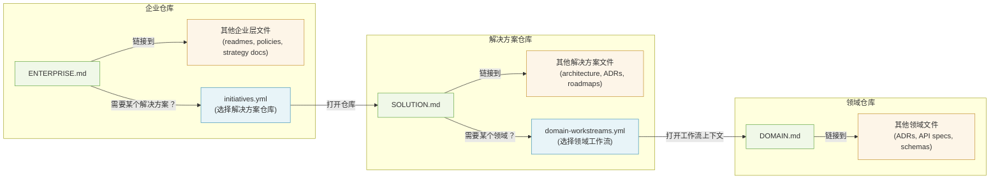

# 提案：多层级仓库导航与路由约定

状态：草案
受众：标准/社区贡献者、平台/工具构建者、企业架构团队
范围：跨企业层、解决方案层、领域层以及实现执行上下文的多仓库人员与 agent 协作

## 1. 问题

`AGENTS.md` 很适合定义仓库本地行为，但企业级交付通常横跨多个仓库和多个架构层级。
在这种规模下，团队需要：

1. 具备层级感知能力的入口文件。
2. 确定性的跨仓库路由。
3. 明确的归属、治理与失败处理行为。

本提案通过层级入口文件（Layer A）以及面向自动化的可选路由目录（Layer B）来解决这些问题。

## 2. 拟议方案

本提案是对第 1 节问题的回应：它让仓库本地指引保持轻量、面向人类，同时在需要时仍能为自动化提供确定性的跨仓库路由能力。

### 指导原则：跨仓库的渐进式披露

本提案在每个尺度上都采用渐进式披露，而不是把所有内容堆到一个仓库和一个文件里：

1. **仓库层级**（存在 Layer B 时）：路由目录（`initiatives.yml`、`domain-workstreams.yml`、`domain-implementations.yml`）披露下一个稳定目标，并在需要时给出要打开的精确工作流上下文。解析是确定性的，要么解析成功，要么失败即关闭（见第 5.5 节）。
2. **文件层级**（Layer A）：入口文件披露该仓库中真正重要的信息。它们是地图，不是百科全书。
3. **工件层级**：被链接的目录和设计文件披露细节，而且只有在你跟随链接时才展开。

每一层都只揭示该层真正相关的信息。当路由目录存在时，它们只是最粗粒度的披露层。

为了实现这一原则，本提案定义了两个彼此独立、可分开采用的层：

1. **Layer A：Entrypoint Convention**
   1. 目的：人员/agent 导航与上下文发现。
   2. 工具依赖：无。
2. **Layer B：Routing Catalog Specification（可选）**
   1. 目的：在不同层级之间进行确定性的机器路由（例如企业仓库 -> 解决方案仓库 -> 领域仓库）。
   2. 工具依赖：需要具备工具能力的消费者，例如 agent、脚本、IDE 集成或编排运行时。

组织可以只采用 Layer A 而不采用 Layer B，但一致性档位从采用路由能力开始。



## 3. Layer A：入口文件约定

### 3.1 入口文件

1. `AGENTS.md`（现有 agents.md 标准；不变）。
2. `ENTERPRISE.md`（企业层入口文件）。
3. `SOLUTION.md`（解决方案层入口文件）。
4. `DOMAIN.md`（领域层入口文件）。

本约定定义了三个架构层级（`ENTERPRISE.md`、`SOLUTION.md`、`DOMAIN.md`），以及一个实现执行角色（`dev`）。`dev` 不是第四个架构层级，也不引入 `DEV.md` 入口文件或单独的顶层路由目录。

### 3.2 入口文件规则

1. `AGENTS.md` 仍然是仓库本地行为契约。
2. 当某一层级在仓库中存在时，对应层级的入口文件 SHOULD 存在。
3. 入口文件 SHOULD 保持简洁，并链接到规范的机器工件，而不是复制易变数据。这一点在目录由生成流程产生时尤其重要：入口文件应链接该工件，而不是复制其内容。
4. 上游入口链接 MUST 是确定性的、显式标明层级的：当企业层存在时，`SOLUTION.md` MUST 包含到 `ENTERPRISE.md` 的链接；当企业层存在时，`DOMAIN.md` MUST 包含到 `ENTERPRISE.md` 的链接。`DOMAIN.md` MUST NOT 要求通过 `SOLUTION.md` 进行上游导航，因为解决方案到领域的关联是多对多关系，并且会随时间变化；这些关联应属于路由目录和交接工件，而不是 Markdown 的父子结构。
5. 当路由目录存在时，下游目标信息 MUST 维护在规范 YAML 目录（`initiatives.yml`、`domain-workstreams.yml`、`domain-implementations.yml`）中。入口文件 MAY 包含轻量级导航链接，但 SHOULD 避免复制详尽的下游映射，以防漂移。
6. 如果不存在上游层级，Parent 部分 MUST 写明 `Not applicable`。
7. Agent MUST 从 `AGENTS.md` 开始。`AGENTS.md` MUST 指示 agent 始终读取当前仓库的层级入口文件（`ENTERPRISE.md`、`SOLUTION.md` 或 `DOMAIN.md`），以获取架构上下文和导航信息。规范的指令形式为：`Always read <LEVEL>.md`。

实现参考：

1. AGENTS 交接模板：`skills/ea-convention/templates/AGENTS.ea.md.template`、`skills/ea-convention/templates/AGENTS.sa.md.template`、`skills/ea-convention/templates/AGENTS.da.md.template`。
2. 层级入口模板：`skills/ea-convention/templates/ENTERPRISE.md.template`、`skills/ea-convention/templates/SOLUTION.md.template`、`skills/ea-convention/templates/DOMAIN.md.template`。
3. 端到端示例：`examples/core/`、`examples/governed/`。

### 3.3 Parent 链接格式

允许的父级链接形式：

1. 指向父级入口文件的绝对 HTTPS URL。
2. 当父级位于同一仓库时，使用仓库相对路径。
3. 稳定的仓库标识符加路径（当 URL 在运行时解析时）。
4. Parent 部分 SHOULD 按层级标注上游链接（例如 `ENTERPRISE`）。

标识符说明：

1. 稳定的仓库标识符 SHOULD 带有提供方限定且持久（例如 `github:example-org/ea-repo`）。
2. 父级引用示例：`github:example-org/ea-repo#/ENTERPRISE.md`。

### 3.4 角色语义

仓库模型隐含了四种常见工作角色：

1. `ea`：企业架构。负责跨解决方案的组合导航、企业层路由语义以及企业治理工件。
2. `sa`：解决方案架构。负责解决方案级分解、工作流路由，以及跨领域的解决方案范围协调。
3. `da`：领域架构。负责领域边界、领域设计基线，以及从 `implementation_id` 到实现目标的权威映射。
4. `dev`：在 `da` 定义范围内工作的实现执行角色。`dev` 消费领域上下文和实现目标，但不构成新的架构层级。

规范性的 `dev` 语义：

1. `dev` 在架构上下文上从属于 `da`。`dev` 的规范上游架构契约是 `DOMAIN.md`、权威的 `domain-implementations.yml`，以及从领域上下文中被显式链接的任意领域自有工件。
2. 归属边界由工件定义，而不是由执行工作的具体人、agent 或工具定义。`da` 拥有设计契约工件，包括领域接口、schema 和实现规范。`dev` 拥有实现本地工件，例如工作代码、测试、构建文件、服务本地文档，以及实现仓库中的仓库本地 `AGENTS.md` 行为。
3. `da` 对 `DOMAIN.md`、`domain-implementations.yml` 和领域设计基线等领域级工件保持权威归属。`dev` MUST NOT 将实现本地文档视为对这些领域工件的覆盖。
4. `dev` 的遍历是“向下读取、本地执行”。`dev` 行为体 MAY 为了实现上下文而消费上游架构工件，但 MUST NOT 在正常实现流程中写回 `da` 拥有的工件。如果编码工作暴露出 `da` 工件中的缺口、歧义或缺陷，该情况 MUST 被升级到对应架构层处理，而不是由 `dev` 直接就地修补。
5. `dev` 不会引入新的必需目录。领域到实现的遍历边界仍然是架构与执行之间的边界。
6. 默认情况下，`dev` 不直接消费 `sa` 工件。只有当相关 `da` 工件将这些上游工件显式链接或委托为领域契约的一部分时，才允许直接消费 `sa` 拥有的工件。
7. 显式 `da` 链接或委托机制由实现自行定义，但 MUST 以 `da` 拥有工件中的权威引用来表示。可接受机制包括来自 `DOMAIN.md` 的稳定 Markdown 链接，或领域自有 YAML 工件中的规范字段。隐式知识、聊天历史或工具特定的工作区状态都不充分。
8. 这些 `dev` 规则是工具无关的。任何在这一层运行的编码 agent 或实现行为体，包括 Codex、Cursor、Copilot 或同类系统，都受相同的遍历与归属约束。
9. 如果同一个团队同时承担 `da` 和 `dev`，仓库 MAY 在操作层面合并角色，但领域级工件与实现本地工件之间的归属边界 SHOULD 仍保持显式。常见机制包括独立目录、CODEOWNERS/文件归属规则，或在相关入口文件中的归属表。

### 3.5 最小入口文件示例

#### ENTERPRISE.md（最小示例）

```markdown
# ENTERPRISE

Purpose: Enterprise portfolio entrypoint.

## Read First
1. This file — enterprise context and navigation

## Parent
Not applicable

## Canonical Artifacts
- initiatives.yml
- domain-registry.yml
```

#### SOLUTION.md（最小示例）

```markdown
# SOLUTION

Purpose: Solution architecture entrypoint.

## Read First
1. This file — solution context and navigation

## Parent
- [ENTERPRISE](https://github.com/example/ea-repo/blob/main/ENTERPRISE.md)

## Canonical Artifacts
- domain-workstreams.yml
- solution-index.yml
```

#### DOMAIN.md（最小示例）

```markdown
# DOMAIN

Purpose: Domain architecture entrypoint.

## Read First
1. This file — domain context and navigation

## Parent
- [ENTERPRISE](https://github.com/example/ea-repo/blob/main/ENTERPRISE.md)

## Canonical Artifacts
- domain-implementations.yml
```

## 4. 引导发现（路由档位的核心要求）

对于路由档位（Core / Governed），实现 MUST 至少提供一种确定性的引导发现机制，用于解析组织中存在的最高层级：

1. 显式启动参数。
2. 环境变量。
3. 约定俗成的发现端点。

引导目标是路由链中的最高层级仓库（三层组织是企业仓库，两层组织是解决方案仓库）。实现 MUST 说明哪一种机制是权威机制。

## 5. Layer B：路由目录规范

路径放置被有意保持为实现自定义。
本标准定义文件名和语义，而不是固定目录结构。

### 5.1 规范目录集合

| Catalog | Level | Selector | Resolves |
|---|---|---|---|
| `initiatives.yml` | Enterprise | `initiative_id` | `solution_repo_url` + `solution_entrypoint` |
| `domain-workstreams.yml` | Solution | `workstream_id` | 工作流上下文（见第 5.3 节） |
| `domain-implementations.yml` | Domain | `implementation_id` | 仓库位置 + 可选入口点/ref |

目录解析是按边界定义的。本规范不保证选择器会跨边界自动传递；调用方必须独立拥有或获取下一边界所需的选择器。实现 MAY 定义跨边界传递选择器的交接机制，但这些机制属于实现自定义。

格式规则：

1. YAML 是本提案中所有目录的规范格式。

作者说明：路由目录通常是生成工件，由摄取流水线从更丰富的源（例如 `initiative-pipeline.yml`）中过滤并生成选择器清单。正因为它们是生成的，所以必须与人工编写的入口文件（`ENTERPRISE.md`）分离。若将它们内联进入口文件，要么会使入口文件也变成生成文件（违背其作为稳定导航指南的角色），要么会产生一个人工维护的副本，并最终与流水线源发生漂移。

### 5.2 版本契约

目录头 MUST 遵循该目录类型的规范 schema：

1. `initiatives.yml` MUST 包含 `version`。
2. `domain-workstreams.yml` MUST 包含 `version`。
3. `domain-implementations.yml` MUST 包含 `spec_name` 和 `spec_version`。

版本规则：

1. `MAJOR`：破坏性变更。
2. `MINOR`：向后兼容的新增。
3. `PATCH`：向后兼容的澄清/修复。

运行时行为：

1. 消费者在遇到未知 `MAJOR` 版本时 MUST 失败即关闭。
2. 生产者在增加 `MAJOR` 版本时 MUST 提供迁移说明。

用于规范目录校验的权威机器可读 schema 维护在 `schemas/` 下。这些 schema 定义了规范目录的结构化校验，并与本节中的目录版本契约一同演进。

### 5.3 最小字段集

跨仓库目标字段：

实现目标元数据的设计目的：

有些组织会保留一个第一方 Domain 仓库作为规范性的架构覆盖层，同时将第三方或开源仓库作为实现目标。在这种模型下，仅有仓库级解析不足以支持确定性的 agent 导航，因为外部仓库可能并未实现本约定，而且可能暴露多个看似合理的入口文件。因此，可选的实现目标元数据允许 Domain 仓库声明 agent 应打开的精确文件，以及在需要时声明架构验证所依据的版本，而无需对外部仓库本身做任何修改。

1. `initiatives.yml` 的条目 MUST 同时包含 `solution_repo_url` 和 `solution_entrypoint`（例如 `SOLUTION.md`）。
2. 当 `domain-registry.yml` 条目包含 `domain_repo_url` 时，MUST 同时包含 `domain_entrypoint`（例如 `DOMAIN.md`）。
3. `domain-workstreams.yml` 条目 MUST 包含 `domain_id`、`workstream_entrypoint` 和 `workstream_git_ref`。
   当企业层存在（即存在 `initiatives.yml`）时，条目还 MUST 包含 `initiative_id`，以将工作流关联到其来源 initiative。当企业层不存在（第 12.2 节定义的两层拓扑）时，`initiative_id` MAY 省略。
   当 `initiative_id` 存在时，它可用于将工作流与 initiative 做关联，但不会创建一个规范性的路由步骤；`domain-workstreams.yml` 的规范选择器仍然是 `workstream_id`。
   `domain_id` 是稳定的目标标识，即使 `workstream_repo_url` 已足以进行直接运行时解析，它仍然是必需字段。
4. `domain-workstreams.yml` 条目 MUST 包含 `workstream_repo_url`，除非运行时能够访问一个权威的 `domain-registry.yml`，可将 `domain_id` 解析为稳定的领域仓库。
5. 在工作流上下文尚未实体化时，`workstream_entrypoint` MAY 为 `null`。对于任何可路由的工作流状态，`workstream_entrypoint` MUST 为非空。
6. `domain-workstreams.yml` 条目 MAY 包含 `workstream_path`，用于标识承载该工作流工件的仓库相对目录。
7. `domain-implementations.yml` 条目 MUST 包含：
   1. `implementation_id`：稳定主键。MUST 在目录内唯一。即使底层仓库重命名、迁移或拆分，也 MUST NOT 变更。
   2. `status`：第 5.4 节定义的生命周期状态。
8. `domain-implementations.yml` 条目 MUST 包含一个 `repo` 对象，含以下字段：
   1. `repo.url`：规范化 VCS 仓库 URL。可选；省略时默认为目录文件所在仓库（单仓模式）。若存在，MUST 为非空规范化 URL；null 或空字符串视为 schema 验证错误（`ERR_INVALID_SCHEMA`）。
   2. `repo.paths`：glob 模式列表，用于界定实现在仓库中的范围。可选；省略时默认为 `["*"]`（整个仓库）。若存在，MUST 为非空列表，每项为非空 glob 字符串。
   3. `repo.aliases`：在重命名过渡期保留的旧规范 URL 列表。可选。别名参与唯一性不变量和 repo-first 解析。实现 SHOULD 强制执行别名退役策略。
   4. `repo.entrypoint`：在解析到目标仓库后应打开的仓库相对文件路径。可选。若存在，MUST 为非空路径字符串。尤其当需要在目标仓库内进行确定性的文件级导航时，实现 SHOULD 提供该字段，特别是对于未采用本约定的外部或第三方仓库。
   5. `repo.git_ref`：标识预期目标版本的分支、标签或提交引用。可选。若存在，MUST 为非空字符串。对于默认分支可变的外部或第三方仓库，实现 SHOULD 优先使用发行标签或 commit SHA。
9. `domain-implementations.yml` 唯一性不变量：对于每个条目，每一对 `(canonical(repo.url), matched repo.path)` MUST 精确映射到一个 `implementation_id`。`paths: ["*"]` 对同一 `repo.url` 最多只能出现一次，且 MUST NOT 与同一 `repo.url` 的其他条目并存。集合 `{repo.url} ∪ repo.aliases` 参与该不变量；任何其他条目都不能在该集合的任一成员上发生重叠。
10. `domain-implementations.yml` 生命周期字段（可选）：
    1. `valid_from`、`valid_to`：限定有效窗口的 ISO 8601 日期。
    2. `replaced_by`：标识后继条目的 `implementation_id` 列表（用于拆分、合并或替换）。被引用条目 MUST 存在于目录中。
11. `domain-implementations.yml` 可追溯字段（可选，不用于路由）：
    1. `workstream_id`：当前负责该实现变更的工作流。瞬时字段；MAY 为 null。
    2. `initiative_id`：来源 initiative。若存在，MUST 与对应的 `domain-workstreams.yml` 和 `initiatives.yml` 条目保持一致。
    3. `owners`：团队或个人所有者列表。
    4. `oda_component_name`、`tmfc_component_id`：TM Forum ODA 组件引用。

#### initiatives.yml

```yaml
version: "1.0"
initiatives:
  - initiative_id: init-example
    solution_repo_url: https://github.com/example/solution-repo
    solution_entrypoint: SOLUTION.md
    status: active
```

#### domain-workstreams.yml

```yaml
version: "1.0"
workstreams:
  - workstream_id: ws-init-example-order
    initiative_id: init-example
    domain_id: order
    workstream_entrypoint: inputs/workstreams/ws-init-example-order/WORKSTREAM.md
    workstream_git_ref: feature/ws-init-example-order
    workstream_repo_url: https://github.com/example/order-domain-repo
    workstream_path: inputs/workstreams/ws-init-example-order/
    status: active
```

#### domain-implementations.yml

```yaml
spec_name: multi-scale-routing
spec_version: "1.0.0"
implementations:
  # 单仓示例 —— 省略 repo.url（默认使用目录所在仓库），使用路径限定范围
  - implementation_id: order-api
    status: active
    repo:
      paths: ["src/order-api/*"]

  # 多仓示例 —— 显式 url，多路径
  - implementation_id: payments-risk-service
    status: active
    repo:
      url: https://github.com/example/payments-risk
      paths:
        - services/risk/*
        - batch/risk-jobs/*
      entrypoint: services/risk/README.md
      git_ref: main
    # traceability（可选）
    workstream_id: ws-init-example-payments
    owners: [payments-team]

  # 采用上游 —— 外部仓库，带确定性文件目标
  - implementation_id: identity-keycloak-upstream
    status: active
    repo:
      url: https://github.com/keycloak/keycloak
      paths: ["*"]
      entrypoint: README.md
      git_ref: 26.1.0
    # traceability（可选）
    owners: [identity-architecture]

  # 废弃 —— 被后继项替代
  - implementation_id: payments-legacy
    status: deprecated
    valid_to: "2026-12-31"
    replaced_by: [payments-risk-service]
    repo:
      url: https://github.com/example/payments-legacy
      aliases:
        - https://github.com/example/old-payments
      paths: ["*"]
```

### 5.4 状态词汇表（规范性）

允许值：

1. `active`
2. `approved`
3. `ready`
4. `in_progress`
5. `paused`
6. `completed`
7. `archived`
8. `deprecated`
9. `inactive`

语义：

1. `active`：可路由。
2. `approved`：默认不可路由；工作已获批准但尚未开始。
3. `ready`：默认不可路由；工作已准备好开始。
4. `in_progress`：可路由；工作正在进行中。
5. `paused`：默认不可路由；可由策略决定是否恢复。
6. `completed`：只读历史状态。
7. `archived`：历史状态，通常不出现在活动选择器视图中。
8. `deprecated`：只读墓碑状态；绝不能用于写操作路由。解析器 MAY 解析并发出 `deprecated_target` 警告。条目在存在后继者时 SHOULD 包含 `replaced_by`。
9. `inactive`：已从路由中显式移除。不可路由；解析器 MUST 以 `ERR_SELECTOR_NOT_ROUTABLE` 失败即关闭。与 `archived` 不同，`inactive` 条目 MAY 恢复为 `active`。

默认可路由状态：`active`、`in_progress`。

并非所有状态都同等适用于每个目录。例如，`in_progress` 通常用于工作流和 initiative；`domain-implementations.yml` 条目通常使用 `active`、`deprecated` 和 `inactive`。

实现 MAY 通过显式配置将 `approved` 和/或 `ready` 也纳入可路由集合。若实现扩展了可路由集合，MUST 在配置或运行时元数据中声明生效的可路由状态集合，以便消费者无需依赖实现私有知识即可判断当前路由掩码。

### 5.5 路由策略

1. 对缺失选择器 ID 失败即关闭（`ERR_SELECTOR_MISSING`）。
2. 对歧义选择器 ID 失败即关闭（`ERR_SELECTOR_AMBIGUOUS`）。
3. 默认对不可路由状态失败即关闭（`ERR_SELECTOR_NOT_ROUTABLE`）。
4. 参与路由或入口导航的跨文件引用，在对应权威工件集对解析器或校验器可用时，MUST 能在当前拓扑的权威工件集中正确解析。未解析或悬空引用属于无效约定状态，并且 MUST 失败即关闭。
5. 至少以下引用在对应工件存在且对解析器或校验器可用时 MUST 能解析：
   1. `domain-workstreams.yml[].initiative_id` -> `initiatives.yml[].initiative_id`
   2. `domain-workstreams.yml[].domain_id` -> `domain-registry.yml[].domain_id`
   3. `solution_entrypoint` / `domain_entrypoint` / `workstream_entrypoint` / `repo.entrypoint` -> 被引用仓库/版本中的真实文件
6. 实现 MUST NOT 回退到仓库名启发式、关键词搜索或其他推断上下文。

无论是否实现了可选的机器访问契约（第 5.7 节），这些错误语义对所有路由行为都是规范性的。实现如何暴露这些错误（结构化错误对象、异常、日志事件）由实现自行决定；必须“失败即关闭”的行为要求不变。

### 5.6 选择器唯一性

1. 每个选择器字段 MUST 在其目录内部独立唯一。
2. 当目录在 `domain-implementations.yml` 中定义 `implementation_id` 时，每个值 MUST 在该目录内唯一。
3. 实现 MUST 在存在重复选择器值时失败即关闭。

### 5.7 可选的机器访问契约

实现 MAY 在规范路由目录之上暴露机器访问接口。

本节只定义查询语义。传输方式、调用语法、认证方式、编程语言和部署模型均由实现自行定义。

契约规则：

1. 必需操作：
   1. `resolve`：根据规范选择器类型和值返回单个条目。
   2. `list`：返回某一目录中的条目，并可按精确状态进行过滤。
   3. `validate`：根据第 7 节中的最小检查项报告目录完整性。
2. 输入契约：
   1. `resolve` 输入 MUST 包含规范选择器类型和选择器值。
   2. `list` 输入 MAY 包含目录标识符和精确状态过滤条件。
   3. 实现 MUST NOT 依赖模糊搜索、关键词搜索或推断式选择器别名来完成核心解析行为。
3. 输出契约：
   1. `resolve` 响应 MUST 包含第 5.3 节中该目录类型要求的规范字段。
   2. `list` 响应 MUST 为每个返回条目保留其规范语义。
   3. 在规范字段保持存在且未被修改的前提下，实现 MAY 添加元数据或扩展字段。
4. 错误契约：
   1. 结构化错误 MUST 包含 `error_code`。
   2. 实现 MUST 至少支持 `ERR_SELECTOR_MISSING`、`ERR_SELECTOR_AMBIGUOUS` 和 `ERR_SELECTOR_NOT_ROUTABLE`。
   3. 在适用时，实现 MAY 还会发出第 11 节中的其他错误码。
5. 冲突规则：
   1. 规范 YAML 始终是权威来源。
   2. 实现 MUST NOT 返回与权威 YAML 内容在规范语义上相冲突的结果。
6. 新鲜度规则：
   1. 实现 MUST 要么返回与当前权威 YAML 修订一致的结果，要么显式声明该响应所代表的修订版本或陈旧边界。

配套指导与示例实现模式见 `reference/machine-access-contract.md`。

## 6. 兼容性与别名策略

规范键名：

1. `workstreams[]` + `workstream_id`
2. `implementations[]` + `implementation_id`

迁移策略：

1. 写入方 MUST 输出规范键名。
2. 读取方 SHOULD 强制使用规范键名，以获得确定性行为。
3. 旧别名不属于本草案基线范围。

## 7. 校验要求

本约定的校验器 MUST 检查：

1. 使用 `schemas/` 下权威 schema 进行 schema 与必需字段一致性校验
2. 选择器唯一性（见第 5.6 节）
3. 第 5.5 节中所有规范引用的跨文件引用完整性
4. 状态策略一致性
5. 相对于第 5.2 节的目录版本兼容性

当被引用的仓库或版本对校验器可访问时，它 SHOULD 还检查：

1. 被引用仓库 URL 是否可被校验器身份访问（或通过等效的提供方 API）
2. 被引用入口路径是否存在于目标仓库/版本中

配套操作指导，包括 CI 实现模式和可观测性实践，维护在 `reference/operational-guidance.md` 中。

## 8. 归属模型

| Artifact | 推荐所有者 | 主要用途 |
|---|---|---|
| `AGENTS.md` | 仓库所有者 | 仓库本地 agent 行为契约 |
| `ENTERPRISE.md` | EA | 企业上下文入口 |
| `SOLUTION.md` | SA | 解决方案上下文入口 |
| `DOMAIN.md` | DA | 领域上下文入口 |
| `initiatives.yml` | EA/PMO | 企业 -> 解决方案路由 |
| `domain-workstreams.yml` | SA | 解决方案 -> 领域路由 |
| `domain-implementations.yml` | DA | 领域 -> 实现路由 |
| implementation repo local artifacts | Dev | 在 DA 定义目标范围内进行实现执行 |
| 治理状态工件 | 治理团队 + 各层所有者 | 阶段闸门与进度 |

覆盖规则：

1. 如果多个角色在同一团队/仓库中合并承担，MUST 在相关入口文件中显式声明归属。

## 9. 一致性档位

### Core 档位

必需项：

1. Layer A（`AGENTS.md` 加上适用的层级入口文件）
2. 针对组织中存在的最高层级的确定性引导发现机制
3. 为组织中实际存在的每个层级边界提供路由目录：
   1. 企业 -> 解决方案（当企业层和解决方案层都存在时）：`initiatives.yml`
   2. 解决方案 -> 领域（当解决方案层和领域层都存在时）：`domain-workstreams.yml`
   3. 领域 -> 实现（当存在选择器驱动的领域到实现路由边界时）：`domain-implementations.yml`

对于两层组织（例如只有 Solution + Domain），只要使用 `domain-workstreams.yml` 支持解决方案到领域的工作流路由，就满足 Core 档位。只有当范围中存在选择器驱动的领域到实现路由时，才需要 `domain-implementations.yml`。不存在的边界不要求对应目录。

Core 档位解析规则：

1. 当运行时没有权威的 `domain-registry.yml` 可用时，`domain-workstreams.yml` MUST 对运行时解析自给自足。
2. 在这种情况下，每个工作流条目 MUST 包含 `workstream_repo_url`。
3. 当运行时可访问权威 `domain-registry.yml` 时，`workstream_repo_url` MAY 省略，此时通过 `domain_id` 经由该注册表解析。

### Governed 档位

必需项：

1. Core 档位
2. 领域治理注册表（例如 `domain-registry.yml`）
   1. 当某个领域条目包含 `domain_repo_url` 时，MUST 包含 `domain_entrypoint`
3. 解决方案范围/索引清单（例如 `solution-index.yml`）
4. 治理状态工件，至少包含以下字段：
   1. `spec_name`
   2. `spec_version`
   3. `layers`（以级联层名称为键的字典，每层包含 `status`）

治理层状态值与第 5.4 节中的路由状态词汇表是分离的。允许的治理层状态值：`not_started`、`in_progress`、`proposed`、`approved`、`blocked`、`rejected`。

最小示例：

```yaml
spec_name: governance-state
spec_version: "1.0.0"
layers:
  requirements:
    status: approved
    approved_by: product-owner
    approved_at: "2026-02-28T10:00:00Z"
  solution_architecture:
    status: in_progress
  domain_architecture:
    status: not_started
```

## 10. 冲突解决与优先级

按关注点的优先级：

1. Agent 行为/安全约束：`AGENTS.md` 优先。
2. 路由与目标解析：路由目录优先。
3. 叙述性/上下文说明：层级入口文件（`ENTERPRISE.md` / `SOLUTION.md` / `DOMAIN.md`）优先。

如果两个工件在同一关注点域内发生冲突：

1. 运行时 MUST 失败即关闭。
2. 运行时 MUST 发出结构化冲突错误事件。

## 11. 错误代码

实现若以结构化方式暴露路由或校验失败，在适用时 MUST 支持以下错误代码：

1. `ERR_SELECTOR_MISSING`
2. `ERR_SELECTOR_AMBIGUOUS`
3. `ERR_SELECTOR_NOT_ROUTABLE`
4. `ERR_TARGET_UNREACHABLE`
5. `ERR_ACCESS_DENIED`
6. `ERR_PARENT_LINK_MISSING`
7. `ERR_CONFLICT`
8. `ERR_INVALID_SCHEMA`：目录条目存在结构错误（例如 `repo.url` 键存在但值为 null 或空字符串，`repo.paths` 为空列表）。
9. `ERR_OVERLAPPING_PATHS`：两个或多个 `domain-implementations.yml` 条目产生重叠的 `(repo.url, repo.path)` 绑定，违反唯一性不变量。
10. `ERR_NO_CONTEXT`：解析器的活动上下文中没有已加载的目录（在没有打开 Domain 仓库的情况下进行 repo-first 冷启动）。
11. `ERR_REFERENCE_UNRESOLVED`：规范性的仓库内或跨仓库引用未能解析到存在的选择器目标或文件。

配套可观测性指导，包括建议的失败记录字段与日志模式，维护在 `reference/operational-guidance.md` 中。

## 12. 部分采用模式

### 12.1 单层仓库

1. 使用 `AGENTS.md` 加一个层级入口文件。
2. 路由目录是可选的。

### 12.2 两层结构（Solution + Domain）

1. 使用 `SOLUTION.md` 和 `DOMAIN.md`。
2. 只对实际存在的边界使用路由目录。
3. `ENTERPRISE.md` 和 `initiatives.yml` 是可选的。
4. 在这种拓扑中，`DOMAIN.md` 不需要 `SOLUTION.md` 作为父级链接。解决方案到领域的关系仍然是多对多的，应从 `domain-workstreams.yml` 或等效交接工件中发现。

### 12.3 三层结构（Enterprise + Solution + Domain）

1. 在全部三个层级边界上使用完整 Layer A + Layer B，以实现逐边界的确定性路由。

## 13. 发现与遍历

自顶向下的逐边界路由序列（每一步都要求调用方持有该边界所需的选择器）：

1. `initiative_id` -> `initiatives.yml` -> 解决方案仓库 + `solution_entrypoint`
2. `workstream_id` -> `domain-workstreams.yml` -> `domain_id` + `workstream_entrypoint` + `workstream_git_ref`
3. 工作流目标的仓库解析：
   1. 若 `domain-workstreams.yml` 中存在 `workstream_repo_url`，则使用它
   2. 否则解析 `domain_id` -> 权威 `domain-registry.yml` -> `domain_repo_url`
4. `implementation_id` -> `domain-implementations.yml` -> 仓库位置 + 可选 `repo.entrypoint` + 可选 `repo.git_ref`（当存在选择器驱动的领域到实现路由边界时）

开发者遍历语义：

1. `dev` 启动锚定于领域层：`AGENTS.md` -> `DOMAIN.md` -> `domain-implementations.yml` -> 目标实现仓库及可选 `repo.entrypoint` / `repo.git_ref`。
2. 打开目标实现仓库后，该仓库本地的 `AGENTS.md` 成为活动的仓库本地行为契约。
3. `dev` MAY 在实现前或实现过程中读取额外的、由 `da` 链接的设计契约工件，例如接口、schema 和实现规范。只有当这些工件经由权威领域上下文显式链接或委托时，`sa` 工件才属于可读取范围。
4. `dev` 遍历不得绕过 `da` 语义。如果实现仓库缺乏足够的架构上下文，解析器 SHOULD 返回 `DOMAIN.md` 和相关领域工件，而不是仅凭仓库名或代码结构推断意图。
5. `dev` MUST NOT 将反向遍历视为对上游工件的隐式写权限。从实现回到架构的反向遍历仅用于可追溯性、上下文恢复和升级：`implementation_id` -> `domain-implementations.yml` -> `DOMAIN.md` -> 必要时继续上游层级。

自底向上的发现：

1. 当企业层存在时，领域 agent 通过 `DOMAIN.md` 中的上游链接读取 `ENTERPRISE.md`。
2. 如果企业层不存在，`DOMAIN.md` MAY 使用 `Parent: Not applicable`；解决方案关联仍应通过 `domain-workstreams.yml` 或等效交接工件恢复，而不是通过 Markdown 父级链接。
3. 当企业层存在时，解决方案 agent 通过 `SOLUTION.md` 的父级链接读取 `ENTERPRISE.md`。
4. 当这些 ID 存在于目录条目中时，agent MAY 使用共享 ID（`initiative_id`、`workstream_id`、`domain_id`）进行部分谱系重建。核心目录最小字段集并不保证从实现工件到业务 initiative 的端到端谱系（见第 5.3 节）。

## 14. 与 agents.md 的兼容性

本提案是增量性的：

1. `AGENTS.md` 仍然是基础标准，并未被替换。
2. `ENTERPRISE.md` / `SOLUTION.md` / `DOMAIN.md` 扩展了多层级仓库的导航能力。
3. 在路由档位之外，路由目录是可选的。
4. Claude Code 的兼容性通过从 `CLAUDE.md` 桥接到本约定定义的仓库流来实现；本提案并不假定 Claude Code 对 `AGENTS.md` 有原生支持。

参考实现布局、操作映射模式、agent 上下文指导和采用说明，维护在 `reference/` 下的配套文档中。
