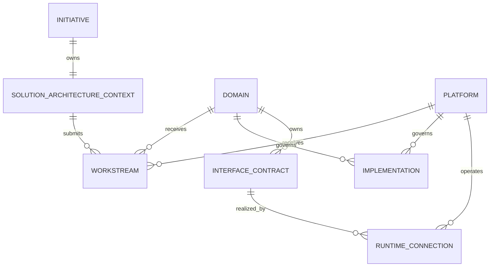

# Proposal: Coupled Initiative and Solution Architecture Identity

**Proposal version:** 0.13.0
**Status:** Accepted; convention handoff slice implemented in this change
**Date:** 2026-08-07
**Target owner:** `enterprise.md`, the canonical owner of the Multi-Level
Repository Navigation and Routing Convention
**Potential target contracts:** additive `domain-workstreams` 1.x routing,
`domain-change-handoff` 1.0, `solution-index` 2.0, portable architecture
state-delta artifacts, Enterprise State Graph integration extensions, and an
OA Engine acceptance/reference contract

## Summary

The convention defines an Initiative as the unit of authorized change and
Solution Architecture as the change-specific design produced for that
Initiative. They have one lifecycle identity at the enterprise-to-solution
boundary:

```text
initiative_id -> exactly one Solution Architecture context
```

There is no independent, reusable `solution_id`.

If the enterprise architecture does not need to change, there is no new
Initiative. If new change is authorized, the Initiative receives a new Solution
Architecture context. That context may reuse existing enterprise architecture
elements unchanged while proposing additions, changes, or retirements elsewhere.

This proposal:

1. ratifies the existing one-to-one cardinality;
2. rejects a separate `solution_id` and Initiative-Solution binding catalog;
3. identifies accepted domain, platform, integration, contract, capability,
   pattern, and implementation designs as reusable enterprise architecture
   state; and
4. proposes replacing ambiguous `solution_key` identity in a future
   `solution-index` contract with the governing `initiative_id`; and
5. proposes an optional, canonical, immutable Workstream change handoff without
   reinterpreting the legacy `handoff_ref` field.

It does not change current schemas, templates, examples, or validators.

## Architectural Principle

> **Initiatives authorize change. Solution Architecture owns the end-to-end
> design of that change. Domain Architecture and Platform/SRE ownership absorb
> the applicable design into their durable domain and production baselines.**

This produces three different ownership and lifecycle boundaries:



The `SOLUTION_ARCHITECTURE_CONTEXT` is not an independently identified
enterprise entity. It is the architecture context of its Initiative and uses
that Initiative's `initiative_id`.

## Entity Model

### Initiative

- **Purpose:** authorize and govern a bounded unit of enterprise change
- **Owner:** EA, portfolio governance, or PMO
- **Identifier:** `initiative_id`
- **Lifecycle:** proposed, approved/ready, active/in-progress, completed,
  archived
- **Relationship to Solution Architecture:** exactly one active design context
  for the Initiative

### Solution Architecture context

- **Purpose:** design how the Initiative's outcome is realized across domains,
  applications, integrations, data, and infrastructure
- **Owner:** Solution Architecture
- **Identifier:** the governing `initiative_id`
- **Lifecycle:** subordinate to the Initiative lifecycle
- **Repository identity:** `solution_repo_url` + `solution_entrypoint` +
  `solution_git_ref` are location/revision coordinates, not a second identity
- **Reuse rule:** the Initiative-scoped context is not adopted wholesale as the
  identity of another Initiative, but accepted architecture elements designed
  within it become enterprise state and MAY be reused by stable reference

### Domain

- **Purpose:** own stable reusable business meaning, capabilities, invariants,
  interfaces, and domain design baselines
- **Owner:** Domain Architecture
- **Identifier:** `domain_id`
- **Lifecycle:** long-lived and independent of any one Initiative
- **Relationship to Initiatives:** receives zero or more Initiative-scoped
  workstreams

### Platform

- **Purpose:** maintain the durable production-centric view of technical
  platforms, runtime services, integration mechanisms, operational guardrails,
  and how deployed platforms communicate
- **Owner:** Platform Engineering, Integration Platform Engineering, SRE, or an
  explicitly delegated operational architecture authority
- **Identifier:** a future stable `platform_id`; its exact catalog and
  entrypoint contract are outside this proposal
- **Lifecycle:** long-lived and independent of any one Initiative
- **Relationship to Initiatives:** receives zero or more Initiative-scoped
  platform workstreams

Integration is not a third ownership level alongside Domain and Platform, but
it is a first-class architectural relationship between otherwise decoupled
components. Solution Architecture owns the Initiative's end-to-end interaction
and runtime design, including any new platform component or communication
mechanism.
Domain Architecture reconciles the affected business semantics and boundary
contracts into its durable domain baseline. Platform/SRE ownership validates
production fitness and reconciles the affected deployment topology,
communication paths, capacity, resilience, security, observability, and
operating model into a durable platform baseline. A change affecting more than
one authority produces coordinated workstreams rather than ambiguous shared
ownership.

### Integration relationship

- **Purpose:** make communication between decoupled components explicit without
  merging their ownership boundaries
- **Solution authority:** SA designs the end-to-end relationship and changes to
  it under the governing `initiative_id`
- **Semantic authority:** the providing Domain or component owns the stable API,
  event, or schema contract identified by `interface_id`
- **Operational authority:** Platform/SRE owns the deployed realization of that
  contract, identified by a future stable `connection_id`
- **Runtime content:** endpoints, broker or gateway, queue or topic, protocol,
  network path, security controls, capacity, resilience, observability, and
  operational dependencies
- **Lifecycle:** introduced or changed through an Initiative, then retained in
  the durable Domain and Platform/SRE baselines after the Initiative completes

This separates two things SRE should not have to conflate:

```text
interface_id  = what communicating components promise
connection_id = how that promise is realized and operated in production
```

The two identifiers remain linked for traceability. SRE can navigate by
`platform_id` and `connection_id` without using Domain Architecture as its
primary operating model.

### Workstream

- **Purpose:** carry one Initiative's requested change into exactly one durable
  downstream architecture authority
- **Owner:** SA owns the end-to-end design and handoff; the receiving Domain or
  Platform/SRE authority owns reconciliation, production acceptance, and its
  durable baseline
- **Identifier:** `workstream_id`
- **Cardinality:** one Initiative has many workstreams; one Domain or Platform
  receives many workstreams over time
- **Current contract limitation:** `domain-workstreams.yml` represents only the
  Domain target case; Platform routing requires a separately versioned proposal

## Normative Cardinality

The intended cardinalities are:

| Relationship | Cardinality | Meaning |
| --- | --- | --- |
| Initiative to Solution Architecture context | 1:1 | One change initiative has one cross-domain solution-design context. |
| Initiative to Workstream | 1:N | The solution may request changes from many downstream authorities. |
| Domain to Workstream | 1:N over time | One stable domain receives demand from many initiatives. |
| Domain to Implementation | 1:N | One domain may govern many implementation targets. |
| Platform to Workstream | 1:N over time | One stable platform receives demand from many initiatives. |
| Platform to Implementation | 1:N | One platform may govern many implementation targets. |

Each workstream targets exactly one durable authority. When one Solution
Architecture change affects a Domain, an integration platform, and another
Domain, it creates coordinated workstreams for those authorities under the
same `initiative_id`; it does not collapse their ownership into one workstream.

### Example: asynchronous messaging

If the Solution Architecture introduces a JMS broker to support asynchronous
messaging, SA designs the complete solution behavior, including:

- participating applications and interaction sequence;
- queues or topics and message-flow topology;
- domain-owned message meaning and compatibility expectations;
- delivery, ordering, idempotency, retry, and dead-letter behavior;
- authentication, authorization, encryption, and network paths;
- capacity, availability, recovery, observability, and migration requirements;
  and
- the new JMS platform component and its dependencies.

The resulting change is projected into different durable views:

1. affected Domain Architecture owners receive the semantic and boundary
   contract changes relevant to their domains;
2. the Platform/SRE owner receives the JMS topology, deployed dependencies,
   technical communication paths, NFR budgets, production controls, and
   operating expectations; and
3. the Solution Architecture retains the initiative-scoped end-to-end design
   that explains why the pieces exist and how they realize the change.

The Platform/SRE baseline aggregates platform changes from many Initiatives.
Its consumers do not need to reconstruct ten Solution Architectures or adopt
domain vocabulary merely to operate the broker and its communication paths.

The convention MUST NOT introduce:

- an independent `solution_id` selector;
- an Initiative-Solution many-to-many binding;
- multiple active Solution Architecture contexts for one Initiative; or
- one active Solution Architecture context governed by multiple Initiatives.

## Current Routing Contract

The current `initiatives` contract already implements the required one-to-one
relationship:

```yaml
spec_name: initiatives
spec_version: "1.1.0"
initiatives:
  - initiative_id: init-bss-modernization
    name: BSS Modernization
    solution_repo_url: https://github.com/acme/solution-bss
    solution_entrypoint: SOLUTION.md
    solution_git_ref: main
    status: active
```

Resolution remains:

```text
initiative_id
  -> initiatives.yml
  -> solution_repo_url + solution_entrypoint + solution_git_ref
```

No `initiatives` schema change is required to express the cardinality.

The current downstream routing contract is not symmetrical: it specifies
Solution-to-Domain and Domain-to-Implementation routing, but has no explicit
Platform/SRE entrypoint, registry, workstream target, durable production
baseline, or Platform-to-Implementation route. This is an adjacent convention
gap, not a reason to introduce `solution_id`. Resolving it requires a separate
versioned proposal covering whether Platform is represented through a parallel
`PLATFORM.md` authority, which operational artifacts it owns, and how
workstream routing selects Domain versus Platform targets.

## External Rationale: Orange and TM Forum ODA

Orange's account of adopting TM Forum Open Digital Architecture supports this
separation of views. It describes a modular architecture based on standardized
designs, definitions, software components, middleware, reference
implementations, and test kits, with participants designing, building,
operating, and testing end-to-end reference implementations. It also emphasizes
explicit decoupling through Open APIs, integration frameworks, and collaboration
across business owners, architects, developers, integrators, and operations.

Source: [Orange sees Open Digital Architecture as a cornerstone of its
strategy](https://inform.tmforum.org/features-and-opinion/orange-sees-open-digital-architecture-as-a-cornerstone-of-its-strategy)

This source supports the need to preserve both end-to-end solution intent and
durable component, middleware, integration, and operational views. It does not
define the repository entrypoints or routing catalogs proposed here. Treating
that evidence as support for a parallel Platform/SRE authority is therefore a
convention-level inference, not a claim that TM Forum mandates `PLATFORM.md` or
this proposal's exact cardinalities.

The accompanying ODA illustration makes the relationship model especially
clear: Party Management, Core Commerce Management, Production, Engagement
Management, and Intelligence Management remain visibly separate functional
areas, while repeated "Decoupling & Integration" bands connect them. For this
proposal, those functional areas map to independently governed components or
domains, while the bands map to first-class interface contracts and their
platform-operated runtime connections. The integration bands connect the
architecture; they do not erase the boundaries they cross.

## Enterprise Architecture State

Solution Architecture is both an end-to-end design activity and a controlled
change to enterprise architecture state. Its Initiative-scoped design context
contains two different kinds of content:

1. references to architecture elements that already exist and will be reused
   unchanged; and
2. proposed additions, changes, or retirements to architecture elements.

After acceptance, the resulting elements do not disappear when the Initiative
completes. They persist in the appropriate durable enterprise views under
stable identities such as `domain_id`, `platform_id`, `interface_id`, and
`connection_id`. A later Solution Architecture can reference those elements
directly instead of copying or redesigning them.

Conceptually, every Solution Architecture declares an architecture-state delta:

```yaml
initiative_id: init-digital-activation-expansion-2027
architecture_state:
  uses:
    - interface_id: ifc-order-submitted-v1
    - connection_id: conn-order-jms-production
  adds:
    - interface_id: ifc-activation-requested-v1
  changes:
    - connection_id: conn-activation-jms-production
  retires: []
```

`uses` is genuine design reuse. The reused integration design is part of the
new end-to-end Solution Architecture, but its ownership and stable identity
remain in enterprise state rather than being transferred from the earlier
Initiative. The exact state artifact, lifecycle states, and merge/acceptance
rules require coordinated contracts across this convention, Enterprise State
Graph, and OA Engine.

## Platform Authority Boundaries

The adjacent `enterprise-state` repository owns canonical enterprise topology,
history-preserving graph mutation, governance constraints, release-delta
generation, and graph-query exposure. The adjacent `oa_engine` repository owns
governed coordination and replayable lifecycle facts. This proposal MUST
compose with both authorities rather than create a competing state store or
lifecycle engine inside the repository convention.

The authority split is:

| Concern | Authority |
| --- | --- |
| Architecture element content | Canonical Git artifacts in Enterprise, Solution, Domain, and Platform repositories |
| Portable identity, artifact shape, and deterministic navigation | The `enterprise.md` convention |
| Initiative authorization, acceptance, supersession, provenance, and replayable lifecycle facts | OA Engine accepted events and coordination contracts |
| Canonical current/as-built topology, historical graph relationships, and governed graph mutation | Enterprise State Graph (`enterprise-state`) |
| Scoped current-state discovery | Enterprise State Graph MCP, exposed to roles through OA Engine gateway leases |
| Runtime implementation and operability evidence | Platform/SRE and implementation-owned artifacts, admitted through governed evidence references |

The convention therefore defines how a Solution Architecture declares
`uses`, `adds`, `changes`, and `retires` against stable architecture-element
identities. OA Engine binds an accepted design decision to the exact
Initiative, artifact reference, Git commit, digest, authority decision, and
predecessor state. Enterprise State Graph applies a governed release or
curation delta to canonical topology with provenance and history. Neither
system becomes a second author of the architecture content.

Current repository evidence establishes important parts of this boundary:

- Git artifacts own requirement and architecture content while accepted events
  own approval and lifecycle facts;
- architecture baselines and deviation ledgers provide commit-pinned coherence
  management; and
- OA Engine grants selector-scoped read access to the enterprise state/twin
  service;
- Enterprise State Graph uses stable `canonical_key` identities and
  history-preserving canonical relationships; and
- `apply_release` and `apply_curation` are implemented governed mutation paths.

### Designed state versus current state

Enterprise State Graph currently makes an intentional distinction:

1. workspace Git artifacts and the Context Registry hold design intent,
   requirements, mappings, and approvals; and
2. the canonical graph holds current/as-built systems and dependencies, updated
   primarily from production release evidence.

Therefore, an accepted integration design can be reused immediately from its
pinned Git artifact identity, but it enters the canonical current-state graph
only when release or authorized curation evidence applies it. "Enterprise
architecture state" must not silently collapse approved target design and
released current state into one lifecycle status.

The present graph schema is also narrower than the model in this proposal:
`System` and `Component` are the MVP canonical nodes, `Interface` is listed as
optional later work, and `ROUTES_TO` currently represents component
communication without a first-class `connection_id`. Closing the integration
reuse gap belongs primarily in an Enterprise State Graph schema/release-delta
extension, coordinated with portable source artifacts here and OA Engine
acceptance references where governed lifecycle binding is required. ADR-0047
explicitly introduced no new OA Engine event or projection for architecture
coherence, so OA Engine mechanization remains a separate decision.

## Common Architecture Change Model

A change request that targets exactly one Domain or Platform is not a fourth
identity beside Initiative, Solution, and Workstream. It is the content contract
of the Initiative-scoped Workstream:

```text
Initiative = authorization and exactly-one Solution Architecture context
Workstream = one requested architecture change against one durable authority
```

The routing catalog retains only identity, destination, routability, and the
exact handoff location:

```yaml
workstream_id: ws-family-plan-product
initiative_id: init-family-plan
domain_id: product
workstream_entrypoint: inputs/workstreams/ws-family-plan-product/WORKSTREAM.md
workstream_git_ref: feature/ws-family-plan-product
domain_repo_url: https://github.com/example/product-domain
change_handoff_ref:
  ref_version: v1
  artifact_path: inputs/workstreams/ws-family-plan-product/domain-change-handoff.yml
  commit_sha: <40-character-commit>
  digest: sha256:<digest>
status: active
```

`workstream_entrypoint` remains the human/agent navigation document.
`workstream_git_ref` remains a discovery/navigation reference and MAY be a
branch, tag, or commit under the existing 1.x contract. It is not an immutable
artifact identity. The additive, typed `change_handoff_ref` identifies the
portable machine-readable change contract by its repository-relative path,
full commit, and content digest. Its repository is `domain_repo_url`, or the
repository resolved for `domain_id` through the authoritative registry.

The legacy `handoff_ref` field retains its existing unconstrained string/null
semantics. A validator MUST NOT infer that it is a path or attempt to validate
it as a domain change handoff. Existing values such as component handoff keys
and opaque POC identifiers therefore remain compatible. The companion artifact
is optional for existing Workstreams and becomes mandatory only under a future
conformance profile or major catalog version.

The existing `domain-workstreams.yml` remains the minimal routing catalog
rather than becoming a mutable execution database. A future Platform routing
contract may define an equivalent Platform handoff or generalize both under a
separately versioned architecture-change contract.

Recommended shape:

```yaml
spec_name: domain-change-handoff
spec_version: "1.0.0"

workstream_id: ws-family-plan-product
initiative_id: init-family-plan

solution_design_ref:
  ref_version: v2
  artifact_id: art-family-plan-solution-design
  version: "1.0.0"
  repository_url: https://github.com/example/family-plan-solution
  repository_entrypoint: SOLUTION.md
  artifact_path: architecture/solution/architecture-design.yml
  commit_sha: <40-character-commit>
  digest: sha256:<digest>

target:
  kind: domain
  domain_id: product
  baseline_state: existing
  baseline_ref:
    baseline_id: product-P14
    artifact_ref:
      ref_version: v2
      artifact_id: art-product-domain-baseline-P14
      version: P14
      repository_url: https://github.com/example/product-domain
      repository_entrypoint: DOMAIN.md
      artifact_path: architecture/domain/domain-design.yml
      commit_sha: <40-character-commit>
      digest: sha256:<digest>

requested_delta:
  requirements:
    add:
      - req-family-plan-eligibility
  architecture_elements:
    use: []
    add: []
    change: []
    retire: []

acceptance_criteria:
  - criterion_id: ac-family-plan-product-001
    statement: Family-plan eligibility is represented in the Product domain model.

external_refs:
  - system: service-now
    id: CR-4821
```

For a target whose accepted baseline does not yet exist, the alternative shape
is explicit rather than an accidental omission:

```yaml
target:
  kind: domain
  domain_id: new-domain
  baseline_state: not_materialized
  baseline_absence_reason: Domain has no accepted baseline yet.
```

`baseline_ref` is required exactly when `baseline_state` is `existing` and is
prohibited when it is `not_materialized`; a non-empty
`baseline_absence_reason` is required for the latter state.

This corrects seven ambiguities in the example model:

1. `requested_by.initiative` and `requested_by.solution` are not two identities;
   `initiative_id` identifies the Initiative and its Solution Architecture
   context.
2. A solution transition such as `family-plan-transition-1` is an immutable
   `solution_design_ref` or baseline/version reference, not `solution_id`.
3. The target repository is resolved from `domain_id` or `platform_id` through
   its authoritative registry. A repository coordinate may be carried for
   self-sufficient routing but is not target identity.
4. A value such as `P14` must be a qualified, immutable baseline reference, not
   an untyped `state` string.
5. `CR-4821` remains an external-system reference; it does not become a second
   lifecycle identity for the same domain-targeted demand.
6. Baseline existence is an explicit state, not inferred from an optional
   reference.
7. Each acceptance criterion has a stable identity that downstream claims and
   verification evidence can reference.

### Cross-artifact agreement validation

JSON Schema validates the local structure of the catalog entry and handoff.
Before dispatch, the routing resolver MUST fail closed unless all of the
following agreements hold:

```text
catalog.workstream_id == handoff.workstream_id
catalog.initiative_id == handoff.initiative_id
catalog.domain_id == handoff.target.domain_id
change_handoff_ref.artifact_path resolves inside the declared target repository
handoff bytes match change_handoff_ref.digest
change_handoff_ref.commit_sha is a full commit and resolves in that repository
solution_design_ref resolves at its exact commit and matches its digest
baseline_ref resolves at its exact commit when baseline_state is existing
requested requirement IDs resolve in the pinned solution design context
```

When the handoff repository is accessible, the convention validator MUST fail
closed on an unsafe or unresolved handoff path, commit or digest mismatch,
handoff schema failure, catalog identity disagreement, or duplicate acceptance
criterion identity. When the remote repository is unavailable, an offline
validator reports the handoff as unverified without claiming content proof;
that result is not dispatch authorization. The routing runtime remains
responsible for resolving the pinned Solution design, any existing baseline,
and requested requirement identifiers before dispatch.

Each failure diagnostic MUST identify the exact catalog/handoff field and the
reference that failed. These checks are bounded referential-integrity checks,
not a new broad governance gate. A resolver MAY produce an immutable resolution
receipt, but OA Engine dispatch still records the verified handoff as an exact
V2 artifact reference rather than treating `workstream_git_ref` as evidence.

OA Engine introduces a separate coordination identity without replacing the
enterprise demand identity:

```text
workstream_id = stable enterprise demand against one Domain or Platform
work_item_id  = OA Engine coordination event stream for that demand
artifact_ref  = exact version of the requested change contract
```

One active coordination work item may be created or correlated for the
Workstream according to the applicable OA lifecycle contract. Any retry,
successor, recovery, or decomposition semantics remain OA Engine facts and do
not change `workstream_id`.

### Enterprise change graph

The enterprise change graph is a governed coordination/read model whose natural
authority is OA Engine. The following relationship names are proposed semantic
edges, not claims about currently implemented literal edge types:

```text
Initiative
  -> HAS_WORKSTREAM -> Workstream
  -> Workstream TARGETS -> Domain or Platform
  -> Workstream REQUESTS -> Requirement or ArchitectureElement delta
  -> Workstream REALIZED_BY -> PR, commit, artifact, or verification evidence
  -> Release SATISFIES -> Workstream
```

OA Engine should derive these relationships from accepted events, immutable
artifact references, requirement allocations, implementation claims, and
release evidence. PR numbers, branches, repositories, and commits are
realization references, not architecture identities. A PR alone is not terminal
proof; the accepted realization must bind the resulting commit and applicable
verification or release evidence.

Enterprise State Graph has a different responsibility. When a satisfying
release is applied, it updates canonical current/as-built topology through
`apply_release` and retains provenance back to the release, Git SHA, and source
artifacts. It may additionally retain `initiative_id` and `workstream_id` as
provenance extensions, but it does not own the Workstream lifecycle or become
the enterprise change graph. Relationships such as `DERIVED_FROM` or
`EVIDENCED_BY` would require an accepted Enterprise State Graph schema and
release-delta extension; they are not part of its current MVP relationship set.

### Cross-domain change sets

If one external request affects Product, Billing, and Customer, the Initiative
decomposes it into three target-specific Workstreams. A label such as
`family-plan-transition-1` MAY be retained as a subordinate `change_set_id` or
immutable Solution design-baseline reference when it distinguishes a real
revision or increment. It MUST NOT become a second `solution_id`.

```text
init-family-plan
  -> change-set: family-plan-transition-1
     -> ws-family-plan-product
     -> ws-family-plan-billing
     -> ws-family-plan-customer
```

### Verified implementation reality and alignment gaps

The current convention and OA Engine provide pieces of this model but not the
complete common contract. The convention has Workstream routing. OA Engine has
separate `work_item_id`, parent/predecessor relationships, immutable repository
bindings, V2 artifact references, requirement allocations, implementation
claims, and derived projections. OA Engine does not currently expose a complete
first-class graph with literal `REQUESTS`, `REALIZED_BY`, and `SATISFIED_BY`
edge contracts.

Two cross-repository alignment gaps were verified while reviewing this model:

1. OA Engine's vendored `domain-workstreams.schema.json` still accepts the
   top-level `execution` block that the canonical convention now prohibits.
2. OA Engine's `repository_binding.schema.json` still permits optional
   `correlation.solution_id`. Under this proposal, new bindings should use
   `initiative_id` plus stable element/workstream identifiers; deprecating or
   removing `solution_id` requires a separately approved OA contract revision.

The canonical convention slice now adds the portable
`domain-change-handoff` schema, optional typed `change_handoff_ref`, template,
and accessible-artifact validator while preserving legacy `handoff_ref`.
Synchronizing OA Engine's vendored routing schema or adding OA Engine
relationship/event contracts remains a separate downstream change.

The earlier 62-test result did not prove this handoff contract. The convention
slice adds direct schema, legacy-compatibility, exact-Git-byte, digest,
catalog-agreement, and stable-criterion regression coverage. The proposal and
implementation still become durable only when committed through the
repository's normal change process. The completed convention boundary run is
72 passed.

Recommended adoption sequence:

1. **Implemented here:** define the canonical `domain-change-handoff` artifact
   schema in this convention;
2. **Implemented here:** add optional typed `change_handoff_ref` to the
   canonical routing schema and template while preserving legacy
   `handoff_ref` unchanged;
3. **Implemented here:** validate accessible exact Git bytes, digest, schema,
   catalog agreement, and stable criterion identity; remote routing runtimes
   retain the fail-closed verification obligation;
4. **Separate OA slice:** bind the exact verified handoff artifact when OA Engine initializes or
   correlates the
   Workstream coordination work item;
5. derive realization relationships from accepted bindings, claims, evidence,
   and release facts; and
6. apply the released topology effect to Enterprise State Graph only through
   its governed release path.

## What Reuse Means

### Reusable across Initiatives

Later Initiatives may reuse or depend on:

- domain capabilities and domain design baselines;
- platform capabilities and platform design baselines;
- published APIs, events, schemas, and data contracts;
- accepted integration designs and production connection definitions;
- enterprise principles, standards, and approved patterns;
- shared platforms and implementation components;
- prior architecture decisions that remain applicable;
- accepted architecture elements originally produced by earlier Solution
  Architectures; and
- historical Solution Architecture as provenance or predecessor context.

### What is not reused as identity

A prior Initiative's Solution Architecture MUST NOT become the active Solution
Architecture of a later Initiative.

The later Initiative has different authorized change, scope, timing,
constraints, dependencies, or acceptance conditions. It therefore owns a new
solution change context, even when much of its end-to-end design reuses
unchanged enterprise architecture state.

Example:

```text
init-digital-activation-2026
  -> completed Solution Architecture baseline
  -> accepted interface and connection designs persist in enterprise state

init-digital-activation-expansion-2027
  -> new Initiative-scoped Solution Architecture context
  -> reuses stable domain capabilities, contracts, and connection designs
  -> proposes only the required enterprise-state delta
```

## Repository Topology Does Not Change Identity

The one-to-one logical contract does not require one physical repository per
Initiative.

Several Initiative-scoped Solution Architecture contexts MAY share a
repository if each Initiative resolves to an unambiguous entrypoint and Git
ref. Conversely, one Initiative's implementation may span many repositories.

The following remain invalid identity shortcuts:

- repository name;
- directory name;
- branch or worktree name;
- matching display names; and
- code ownership boundaries.

Only `initiative_id` identifies the Initiative and its Solution Architecture
context.

## `solution_key` Ambiguity

`solution-index.yml` currently requires `solution_key`. This can be mistaken
for an independent Solution identity even though enterprise routing uses
`initiative_id`.

The convention should not maintain two identifiers for the same lifecycle
object.

### Recommended future contract

A future `solution-index` 2.0 should replace required `solution_key` with
required `initiative_id`:

```yaml
spec_name: solution-index
spec_version: "2.0.0"
initiative_id: init-bss-modernization
display_name: BSS Modernization
owners:
  solution_architect: bss-architecture-team
entrypoints:
  solution_md: SOLUTION.md
```

This is a major version because existing consumers may use `solution_key` as a
required lookup field. A 2.0 consumer MUST treat `initiative_id` as the only
Solution Architecture identity and MUST fail closed if it disagrees with the
selected `initiatives.yml` row.

Until such a migration is accepted:

1. `solution_key` remains a repo-local compatibility field;
2. it MUST NOT be treated as an enterprise routing selector;
3. it MUST NOT be called `solution_id`; and
4. consumers use the routed `initiative_id` as the governing identity.

## Invariants

Conforming implementations preserve these invariants:

1. `initiative_id` is globally unique within the enterprise Initiative
   authority.
2. Each routable Initiative resolves exactly one Solution Architecture
   repository, entrypoint, and Git ref.
3. Each routed Solution Architecture context is governed by exactly one
   `initiative_id`.
4. Every enterprise-bound workstream carries that same `initiative_id`.
5. `workstream_id` identifies Initiative-to-downstream-authority demand, not a
   Solution, Domain, or Platform ownership boundary.
6. `domain_id` remains stable across Initiatives.
7. A new Initiative receives a new Solution Architecture change context rather
   than inheriting the identity of a completed Initiative's context.
8. Accepted architecture elements persist in enterprise state under stable
   element identities and MAY be reused by later Solution Architectures.
9. Reuse is expressed through explicit architecture-element references, never
   by assuming the identity of an earlier Initiative.
10. Repository, path, branch, worktree, and display-name similarity never
   establishes identity.
11. Missing or conflicting Initiative identity fails closed.

## Alternatives Rejected

### Independent `solution_id`

Rejected because it creates a second identifier for the same lifecycle object.
It would require synchronization and precedence rules without representing a
real independent business entity.

### Initiative-Solution many-to-many binding

Rejected because Solution Architecture is the design of one Initiative's
change context, not a reusable identity shared by several Initiatives. The
architecture elements it accepts into enterprise state remain reusable.

### One Initiative with multiple Solution Architecture identities

Rejected. A large Initiative may have many domain workstreams, design sections,
delivery increments, or implementation repositories, but they remain parts of
one coherent Solution Architecture context. If governance requires independent
solution ownership and acceptance, the portfolio boundary should be split into
separate Initiatives.

### Reusing a completed Solution Architecture as a new active baseline

Rejected. The completed baseline may be referenced, but a new authorization of
change creates a new Initiative and new solution context. This does not prevent
the later context from reusing accepted integration, domain, platform, or
implementation designs from enterprise state.

## Non-Goals

This proposal does not:

- alter the current `initiatives` routing shape;
- add `solution_id` to any artifact;
- introduce a new Solution registry or binding catalog;
- prevent multiple Initiatives from affecting the same Domains;
- prevent reuse of accepted domain, platform, integration, contract, pattern,
  or implementation designs;
- define the machine-readable enterprise architecture state schema, merge
  protocol, or roadmap semantics;
- implement or modify Enterprise State Graph schemas, release/curation paths,
  or canonical data;
- implement or modify OA Engine schemas, accepted events, projections, or the
  enterprise-twin service; or
- equate Initiative identity with repository or runtime-session identity.

## Version and Migration Impact

Ratifying the one-to-one semantics is a clarification of the existing
`initiatives` 1.x behavior and does not require a catalog version change.

Replacing `solution_key` with `initiative_id` in `solution-index.yml` would be
a separately approved `solution-index` 2.0 change. Migration would:

1. read the governing `initiative_id` from the authoritative Initiative route;
2. write it into the Solution index;
3. preserve display name, description, owners, domains, repositories, and
   entrypoints;
4. remove `solution_key` only in the 2.0 artifact; and
5. validate exact agreement between the Initiative route and Solution index.

No migration may invent an independent `solution_id`.

## Acceptance Criteria

1. The specification states the Initiative-to-Solution Architecture
   cardinality as exactly one-to-one.
2. The specification identifies `initiative_id` as the governing SA identity.
3. The specification distinguishes the Initiative-scoped Solution Architecture
   context from the accepted architecture elements it contributes to durable
   enterprise state.
4. No schema or template introduces `solution_id`.
5. The current `initiatives` selector remains deterministic and singular.
6. Any future `solution-index` 2.0 uses `initiative_id` and validates it against
   the authoritative Initiative route.
7. Examples distinguish the historical Initiative-scoped Solution context from
   accepted architecture elements reused as active enterprise state.
8. Platform/SRE routing and durable production-baseline ownership remain
   explicitly deferred to a separate versioned proposal rather than being
   disguised as Domain routing.
9. Integration is modeled as a first-class relationship with separately owned
   semantic contracts and production runtime connections, not as another
   architecture ownership level.
10. Future Solution Architectures may reuse accepted integration designs by
    stable `interface_id` and `connection_id` references.
11. The convention owns portable artifact and navigation semantics, Enterprise
    State Graph owns canonical current/as-built topology, and OA Engine owns
    governed coordination facts; none duplicates canonical architecture
    content.
12. Approved target design and released current state remain distinguishable.
13. A one-target architecture change is the content of a Workstream, and the
    OA Engine enterprise change graph is a derived coordination view rather
    than a duplicate current-topology graph.
14. `workstream_id`, OA `work_item_id`, immutable handoff `artifact_ref`, and
    external ticket references remain distinct identities.
15. Proposed OA and Enterprise State Graph relationship names are not presented
    as already implemented contracts.
16. Legacy `handoff_ref` retains its existing unconstrained semantics and is
    never treated as the canonical change artifact reference.
17. Optional `change_handoff_ref` binds the canonical handoff to its exact
    repository-relative path, full commit, and content digest.
18. `workstream_git_ref` remains a discovery/navigation ref and is not described
    as immutable evidence.
19. Target baseline existence is discriminated as `existing` or
    `not_materialized`, with the corresponding reference or absence reason
    required.
20. Acceptance criteria have stable `criterion_id` values.
21. A convention validator with repository access enforces exact handoff bytes,
    digest, schema, catalog identity agreement, and stable criterion identity.
    An offline validator reports unavailable remote content without claiming it
    verified; the routing runtime must resolve baseline and requirement
    references and fail closed before dispatch.
22. The canonical companion remains optional for existing Workstreams and may
    become mandatory only through a future conformance profile or major
    catalog version.

## Requested Decision

Accept the following convention decision:

> `initiative_id` is the single identity of an Initiative and its exactly-one
> Solution Architecture context. Solution Architecture is not independently
> reused as another Initiative's identity. Accepted domain, platform,
> integration, contract, pattern, and implementation designs become durable
> enterprise architecture state and may be reused by later Solution
> Architectures through stable element references. The convention will not
> introduce `solution_id` or an Initiative-Solution binding model.

It also accepts the following staged contract decision:

> The convention adds a canonical `domain-change-handoff` 1.0 schema and
> an optional typed `change_handoff_ref` in the current routing contract. The
> new reference binds path, full commit, and digest; it does not reinterpret
> legacy `handoff_ref`. Cross-artifact agreement is validated fail closed. A
> future profile or major version may require the companion for newly
> dispatched Workstreams.

Acceptance authorizes a bounded convention schema, template, specification,
and validator change as the first implementation slice. It does not by itself
authorize the optional `solution-index` 2.0 migration, an enterprise state
schema, canonical Enterprise State Graph mutation, or any OA Engine
implementation change. OA's later bounded slice is to resolve and verify the
handoff, record its immutable V2 artifact reference on Workstream
initialization, and leave richer enterprise-change-graph projection to a
separate decision.
