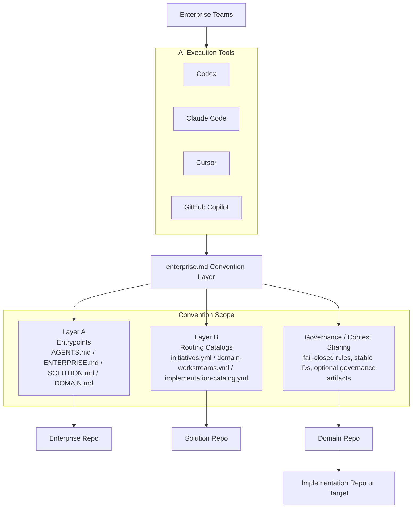

# Ecosystem Positioning

## Standards-Style Positioning

`enterprise.md` is a proposed standard for multi-repository AI navigation, routing, and context-sharing.

It does not replace or compete with AI coding tools.

Instead, it provides a common convention that existing tools can implement or follow when operating across enterprise, solution, domain, and implementation repositories.

The standard is intended to complement existing tools by defining:

1. level-aware entrypoints
2. deterministic selector-based routing
3. artifact-based context sharing across isolated sessions
4. fail-closed governance behavior for enterprise automation

## Ecosystem View

## Short Positioning Statements

### Standards Version

`enterprise.md` is an interoperability and navigation convention for AI tools working across enterprise multi-repository delivery.

### Product Ecosystem Version

Codex, Claude Code, Cursor, and Copilot solve AI-assisted execution. `enterprise.md` standardizes how those tools navigate, route, and share context across enterprise-scale repositories.

### Short Version

`enterprise.md` is the multi-repo coordination standard, not the coding assistant.
